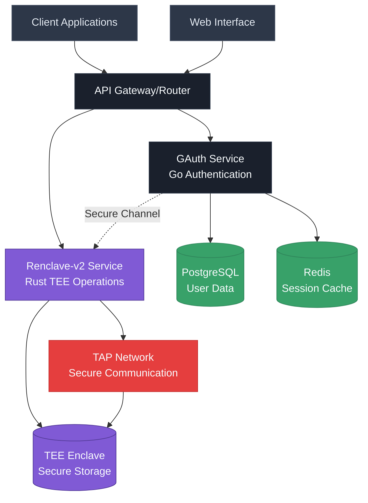
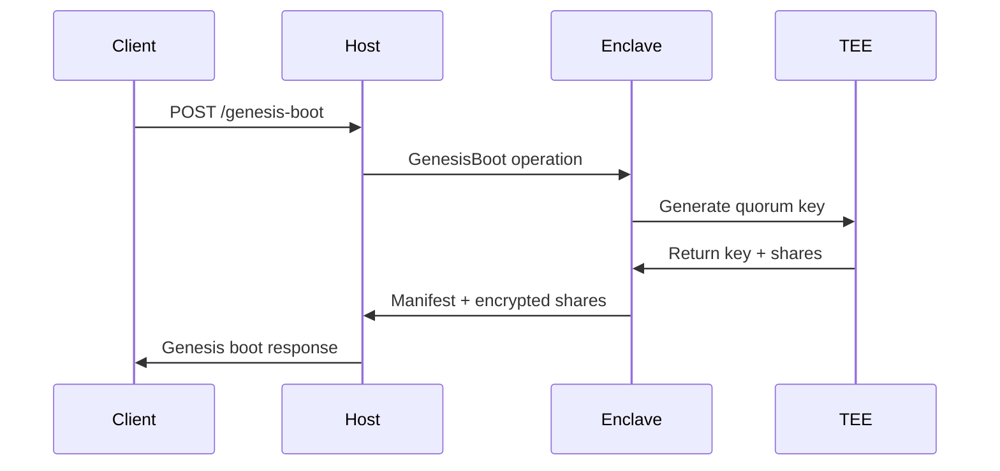
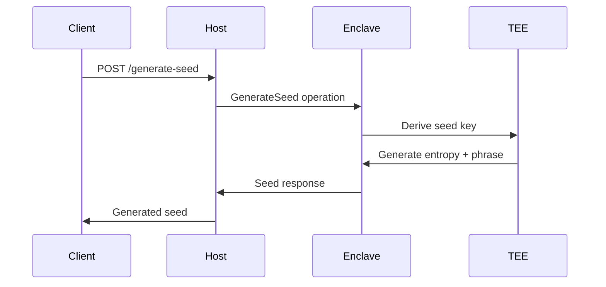
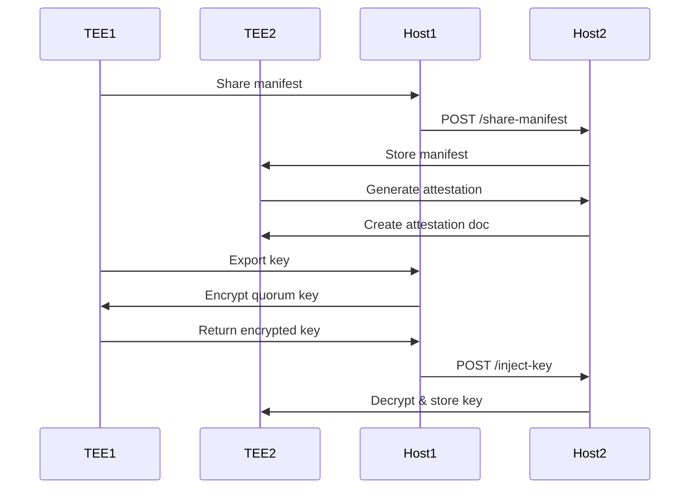

# Renclave Architecture Overview

This document provides a comprehensive overview of the Renclave system architecture, including component organization, file structure, and the relationships between different parts of the system.

## System Architecture

The Renclave system is a sophisticated Trusted Execution Environment (TEE) implementation that provides secure cryptographic operations through a multi-layered architecture.

### High-Level Architecture



## Component Overview

### 1. GAuth Service (Go Authentication)
**Location**: `/gauth/`
**Purpose**: Authentication, authorization, and API management
**Technology**: Go with gRPC and REST APIs

**Key Responsibilities**:
- User and organization management
- Policy-based authorization
- Session handling and authentication
- API request routing and validation
- Integration with renclave-v2 for cryptographic operations

**Architecture**:
```
HTTP Client → REST API (8082) → gRPC Client → gRPC Server (9091) → Business Logic
     │              │                │              │
     │              │                │              └─► Database (PostgreSQL)
     │              │                │              └─► Cache (Redis)
     │              │                │              └─► Enclave (renclave-v2)
     │              │                │
     └─► Direct gRPC Client ─────────┘
```

### 2. Renclave-v2 Service (Rust TEE Operations)
**Location**: `/renclave-v2/`
**Purpose**: Secure cryptographic operations within TEE
**Technology**: Rust with QEMU Nitro Enclave support

**Key Responsibilities**:
- Seed generation and validation
- Quorum-based key management
- TEE-to-TEE communication
- Secure cryptographic operations
- Hardware-backed security guarantees

**Architecture**:
```
┌─────────────────┐    ┌─────────────────┐    ┌─────────────────┐
│   HTTP Client   │◄──►│   QEMU Host     │◄──►│  Nitro Enclave  │
│                 │    │  (API Gateway)  │    │ (Secure Core)   │
├─────────────────┤    ├─────────────────┤    ├─────────────────┤
│ • REST API      │    │ • HTTP Server   │    │ • Seed Generator│
│ • JSON Requests │    │ • Axum Router   │    │ • BIP39 Support │
│ • curl/wget     │    │ • Port 8080     │    │ • Unix Socket   │
└─────────────────┘    └─────────────────┘    └─────────────────┘
                              │                        │
                              ▼                        ▼
                       ┌─────────────────┐    ┌─────────────────┐
                       │   Host Process  │    │   Enclave Core  │
                       │ • API Handlers  │    │ • Crypto Engine │
                       │ • State Mgmt    │    │ • Key Storage   │
                       │ • Communication │    │ • Secure Ops    │
                       └─────────────────┘    └─────────────────┘
```

### 3. Web Interface
**Location**: `/web/`
**Purpose**: User interface for the TEE Auth system
**Technology**: Next.js with TypeScript and Tailwind CSS

**Key Features**:
- User authentication and management
- Organization administration
- Policy configuration
- TEE operations monitoring
- Audit trail visualization

## File Structure and Organization

### Root Directory Structure
```
tee-auth/
├── docs/                    # Comprehensive documentation
├── gauth/                   # Go authentication service
├── renclave-v2/            # Rust TEE service
├── web/                    # Next.js web interface
├── terraform/              # Infrastructure as code
├── research/               # Research and development
├── vsss-rs/               # Shamir Secret Sharing library
└── README.md              # Project overview
```

### Renclave-v2 Detailed Structure
```
renclave-v2/
├── src/
│   ├── host/               # Host process (untrusted)
│   │   ├── src/
│   │   │   ├── main.rs           # Host application entry point
│   │   │   ├── api_handlers.rs   # HTTP API handlers
│   │   │   ├── enclave_client.rs # TEE communication client
│   │   │   └── lib.rs           # Host library
│   │   └── Cargo.toml
│   ├── enclave/            # Enclave process (trusted)
│   │   ├── src/
│   │   │   ├── main.rs           # Enclave entry point
│   │   │   ├── lib.rs           # Enclave library
│   │   │   ├── application_state.rs # State management
│   │   │   ├── attestation.rs   # Attestation handling
│   │   │   ├── data_encryption.rs # Data encryption/decryption
│   │   │   ├── genesis_boot.rs  # Genesis boot process
│   │   │   ├── manifest.rs      # Manifest management
│   │   │   ├── nitro.rs         # Nitro enclave interface
│   │   │   ├── quorum.rs        # Quorum key management
│   │   │   ├── seed_generator.rs # Seed generation
│   │   │   ├── storage.rs       # Secure storage
│   │   │   ├── tee_communication.rs # TEE-to-TEE communication
│   │   │   ├── tee_waiting.rs   # TEE waiting states
│   │   │   └── transaction_signing.rs # Transaction signing
│   │   └── Cargo.toml
│   ├── shared/             # Shared code between host and enclave
│   │   ├── src/
│   │   │   └── lib.rs           # Shared data structures
│   │   └── Cargo.toml
│   ├── network/            # Network connectivity
│   │   ├── src/
│   │   │   ├── lib.rs           # Network library
│   │   │   ├── connectivity.rs  # Network connectivity
│   │   │   └── tap.rs          # TAP network interface
│   │   └── Cargo.toml
│   └── tools/              # Utility tools
│       ├── genesis_key_generator.rs  # Genesis boot key generation
│       ├── member_decryptor.rs      # Member share decryption
│       ├── share_distributor.rs     # Share distribution
│       ├── share_injector.rs       # Share injection
│       └── verification_tool.rs    # Verification utilities
├── docker/                 # Docker configuration
├── scripts/               # Utility scripts
├── tests/                 # Test files
└── Cargo.toml            # Root Cargo configuration
```

### GAuth Detailed Structure
```
gauth/
├── api/                   # API definitions
│   ├── proto/            # gRPC protocol definitions
│   └── rest/             # REST API handlers
├── cmd/                  # Application commands
│   ├── cli/              # Command line interface
│   └── server/           # Server application
├── internal/             # Internal packages
│   ├── db/               # Database layer
│   ├── grpc/             # gRPC server
│   ├── models/           # Data models
│   └── service/          # Business logic services
├── pkg/                  # Public packages
│   ├── config/           # Configuration management
│   ├── logger/           # Logging utilities
│   ├── telemetry/        # Telemetry and metrics
│   └── utils/            # Utility functions
├── migrations/           # Database migrations
├── test/                 # Test files
├── docker/               # Docker configuration
├── observability/        # Monitoring and observability
├── postman/              # API testing collections
└── scripts/              # Utility scripts
```

## Core Components and Their Functions

### 1. Host Process (`src/host/`)

#### `main.rs` - Host Application Entry Point
**Purpose**: Initialize and run the host application
**Key Functions**:
- Set up HTTP server with Axum router
- Initialize enclave client
- Configure API routes and middleware
- Start the application server

```rust
// Key initialization code
#[tokio::main]
async fn main() -> Result<()> {
    // Initialize logging
    env_logger::init();
    
    // Create enclave client
    let enclave_client = EnclaveClient::new()?;
    
    // Set up application state
    let app_state = AppState { enclave_client };
    
    // Configure routes
    let app = Router::new()
        .route("/health", get(health_check))
        .route("/enclave/genesis-boot", post(api_handlers::genesis_boot))
        .route("/enclave/inject-shares", post(api_handlers::inject_shares))
        .route("/enclave/generate-seed", post(api_handlers::generate_seed))
        .route("/enclave/export-key", post(api_handlers::export_key))
        .route("/enclave/inject-key", post(api_handlers::inject_key))
        .route("/enclave/share-manifest", post(api_handlers::share_manifest))
        .route("/enclave/generate-attestation", post(api_handlers::generate_attestation))
        .with_state(app_state);
    
    // Start server
    let listener = TcpListener::bind("0.0.0.0:8080").await?;
    axum::serve(listener, app).await?;
    
    Ok(())
}
```

#### `api_handlers.rs` - HTTP API Handlers
**Purpose**: Handle HTTP API requests and route them to the enclave
**Key Functions**:
- Parse and validate HTTP requests
- Convert JSON to internal data structures
- Call enclave operations
- Format and return responses
- Error handling and logging

```rust
// Example API handler
pub async fn genesis_boot(
    State(state): State<AppState>,
    Json(request): Json<GenesisBootRequest>,
) -> Result<Json<GenesisBootResponse>, (StatusCode, Json<ErrorResponse>)> {
    let request_id = Uuid::new_v4().to_string();
    info!("🔄 Genesis Boot requested (ID: {})", request_id);

    match state.enclave_client.send_request(EnclaveOperation::GenesisBoot {
        namespace_name: request.parameters.namespace_name,
        namespace_nonce: request.parameters.namespace_nonce,
        pivot: request.parameters.pivot,
        manifest_members: request.parameters.manifest_members,
        share_members: request.parameters.share_members,
        threshold: request.parameters.threshold,
    }).await {
        Ok(response) => {
            info!("✅ Genesis Boot completed successfully (ID: {})", request_id);
            Ok(Json(serde_json::to_value(response).unwrap_or(serde_json::Value::Null)))
        }
        Err(e) => {
            error!("❌ Genesis Boot failed: {}", e);
            Err((StatusCode::INTERNAL_SERVER_ERROR, Json(ErrorResponse {
                error: format!("Genesis Boot failed: {}", e),
                code: 500,
                request_id: Some(request_id),
            })))
        }
    }
}
```

#### `enclave_client.rs` - TEE Communication Client
**Purpose**: Manage communication between host and enclave
**Key Functions**:
- Send requests to the enclave via Unix socket
- Handle enclave responses
- Manage connection state
- Error handling and retry logic

```rust
// Enclave client implementation
pub struct EnclaveClient {
    socket_path: PathBuf,
}

impl EnclaveClient {
    pub async fn send_request(&self, operation: EnclaveOperation) -> Result<EnclaveResponse> {
        // Create request with unique ID
        let request = EnclaveRequest {
            id: Uuid::new_v4().to_string(),
            operation,
        };
        
        // Serialize request
        let request_bytes = borsh::to_vec(&request)?;
        
        // Send to enclave via Unix socket
        let response_bytes = self.send_via_socket(&request_bytes).await?;
        
        // Deserialize response
        let response: EnclaveResponse = borsh::from_slice(&response_bytes)?;
        
        Ok(response)
    }
}
```

### 2. Enclave Process (`src/enclave/`)

#### `main.rs` - Enclave Entry Point
**Purpose**: Initialize and run the secure enclave
**Key Functions**:
- Initialize secure enclave environment
- Set up cryptographic components
- Handle incoming requests from host
- Manage enclave state and operations

```rust
// Enclave main loop
pub fn main() -> Result<()> {
    // Initialize enclave
    let mut enclave = SecureEnclave::new()?;
    
    // Main request handling loop
    loop {
        // Wait for request from host
        let request_bytes = receive_from_host()?;
        
        // Deserialize request
        let request: EnclaveRequest = borsh::from_slice(&request_bytes)?;
        
        // Process request
        let response = match request.operation {
            EnclaveOperation::GenesisBoot { .. } => {
                enclave.handle_genesis_boot(request)?
            }
            EnclaveOperation::InjectShares { .. } => {
                enclave.handle_inject_shares(request)?
            }
            EnclaveOperation::GenerateSeed { .. } => {
                enclave.handle_generate_seed(request)?
            }
            EnclaveOperation::ExportKey { .. } => {
                enclave.handle_export_key(request)?
            }
            EnclaveOperation::InjectKey { .. } => {
                enclave.handle_inject_key(request)?
            }
            // ... other operations
        };
        
        // Send response to host
        let response_bytes = borsh::to_vec(&response)?;
        send_to_host(&response_bytes)?;
    }
}
```

#### `application_state.rs` - State Management
**Purpose**: Manage the operational state of the TEE
**Key Functions**:
- Define application phases and states
- Enforce state transitions
- Validate state-dependent operations
- Provide state querying capabilities

```rust
// Application state management
#[derive(Debug, Clone, PartialEq)]
pub enum ApplicationPhase {
    UnrecoverableError,
    WaitingForBootInstruction,
    GenesisBooted,
    WaitingForQuorumShards,
    WaitingForForwardedKey,
    QuorumKeyProvisioned,
    ApplicationReady,
}

impl ApplicationPhase {
    pub fn get_allowed_transitions(&self) -> Vec<ApplicationPhase> {
        match self {
            ApplicationPhase::WaitingForBootInstruction => vec![
                ApplicationPhase::GenesisBooted,
                ApplicationPhase::WaitingForQuorumShards,
                ApplicationPhase::WaitingForForwardedKey,
            ],
            ApplicationPhase::GenesisBooted => vec![
                ApplicationPhase::QuorumKeyProvisioned,
            ],
            ApplicationPhase::WaitingForQuorumShards => vec![
                ApplicationPhase::QuorumKeyProvisioned,
            ],
            ApplicationPhase::WaitingForForwardedKey => vec![
                ApplicationPhase::QuorumKeyProvisioned,
            ],
            ApplicationPhase::QuorumKeyProvisioned => vec![
                ApplicationPhase::ApplicationReady,
            ],
            ApplicationPhase::ApplicationReady => vec![],
            ApplicationPhase::UnrecoverableError => vec![],
        }
    }
}
```

#### `quorum.rs` - Quorum Key Management
**Purpose**: Implement Shamir Secret Sharing for quorum keys
**Key Functions**:
- Generate shares from master secret
- Reconstruct secret from shares
- Validate share integrity
- Handle threshold-based operations

```rust
// Shamir Secret Sharing implementation
pub fn shares_generate(
    secret: &[u8],
    share_count: usize,
    threshold: usize,
) -> Result<Vec<Vec<u8>>> {
    info!("🔧 SSS Generation Debug (using vsss-rs like QoS):");
    info!("  📊 Secret: {} bytes = {:?}", secret.len(), &secret[..std::cmp::min(8, secret.len())]);
    
    // Create polynomial of degree (threshold - 1)
    let mut polynomial = vec![0u8; threshold];
    polynomial[0] = secret[0]; // Set constant term to secret
    
    // Generate random coefficients
    for i in 1..threshold {
        polynomial[i] = thread_rng().gen();
    }
    
    // Generate shares
    let mut shares = Vec::new();
    for i in 1..=share_count {
        let x = i as u8;
        let y = evaluate_polynomial(&polynomial, x);
        
        let mut share = Vec::new();
        share.push(x); // X-coordinate
        share.extend_from_slice(&y); // Y-value
        
        shares.push(share);
    }
    
    Ok(shares)
}

pub fn shares_reconstruct<B: AsRef<[Vec<u8>]>>(shares: B) -> Result<Vec<u8>> {
    let shares = shares.as_ref();
    info!("🔧 SSS Reconstruction Debug (using vsss-rs like QoS):");
    
    // Validate shares
    if shares.is_empty() {
        return Err(anyhow!("No shares provided"));
    }
    
    // Extract x-coordinates and y-values
    let mut points = Vec::new();
    for share in shares {
        if share.len() < 2 {
            return Err(anyhow!("Invalid share format"));
        }
        
        let x = share[0];
        let y = &share[1..];
        points.push((x, y.to_vec()));
    }
    
    // Use Lagrange interpolation to reconstruct secret
    let secret = lagrange_interpolation(&points)?;
    
    // Validate secret length
    if secret.len() != 32 {
        return Err(anyhow!("Reconstructed secret has invalid length: {} bytes (expected 32)", secret.len()));
    }
    
    Ok(secret)
}
```

#### `seed_generator.rs` - Seed Generation
**Purpose**: Generate cryptographic seeds within the TEE
**Key Functions**:
- Generate cryptographically secure entropy
- Create BIP39 seed phrases
- Derive keys from quorum key
- Support different seed types

```rust
// Seed generation implementation
pub fn generate_seed(
    seed_type: &str,
    seed_data: &str,
    quorum_key: &[u8; 32],
) -> Result<GeneratedSeed> {
    // Derive seed generation key
    let seed_key = derive_seed_key(quorum_key, seed_type, seed_data)?;
    
    // Generate random entropy
    let mut entropy = [0u8; 32];
    thread_rng().fill_bytes(&mut entropy);
    
    // Generate BIP39 seed phrase
    let seed_phrase = generate_bip39_phrase(&entropy)?;
    
    // Calculate entropy hex
    let entropy_hex = hex::encode(&entropy);
    
    Ok(GeneratedSeed {
        seed_phrase,
        entropy: entropy_hex,
        strength: 256,
        word_count: 24,
    })
}

fn derive_seed_key(
    quorum_key: &[u8; 32],
    seed_type: &str,
    seed_data: &str,
) -> Result<[u8; 32]> {
    let mut context = Vec::new();
    context.extend_from_slice(seed_type.as_bytes());
    context.extend_from_slice(seed_data.as_bytes());
    
    let hkdf = Hkdf::<Sha256>::new(None, quorum_key);
    let mut derived_key = [0u8; 32];
    hkdf.expand(&context, &mut derived_key)
        .map_err(|_| anyhow!("Seed key derivation failed"))?;
    
    Ok(derived_key)
}
```

#### `tee_communication.rs` - TEE-to-TEE Communication
**Purpose**: Handle secure communication between TEE instances
**Key Functions**:
- Generate attestation documents
- Verify attestation documents
- Encrypt/decrypt keys for transfer
- Manage ephemeral keys

```rust
// TEE-to-TEE communication implementation
impl TEECommunication {
    pub fn generate_attestation_doc(
        &self,
        manifest_hash: &[u8],
        pcr_values: (Vec<u8>, Vec<u8>, Vec<u8>, Vec<u8>),
    ) -> Result<AttestationDocument> {
        // Create attestation document
        let attestation_doc = AttestationDocument {
            user_data: manifest_hash.to_vec(),
            pcr_values,
            signature: self.sign_attestation(&manifest_hash)?,
            public_key: self.get_attestation_public_key()?,
        };
        
        Ok(attestation_doc)
    }
    
    pub fn handle_export_key(
        &self,
        manifest_envelope: &ManifestEnvelope,
        attestation_doc: &AttestationDocument,
    ) -> Result<ExportKeyResponse> {
        // Verify attestation document
        self.verify_attestation_document(manifest_envelope, attestation_doc)?;
        
        // Generate ephemeral key pair
        let ephemeral_private = generate_p256_private_key();
        let ephemeral_public = derive_public_key(&ephemeral_private);
        
        // Encrypt quorum key
        let encrypted_quorum_key = ecies_encrypt(&self.quorum_key, &ephemeral_public)?;
        
        // Sign encrypted key
        let signature = sign_with_quorum_key(&encrypted_quorum_key, &self.quorum_private_key)?;
        
        Ok(ExportKeyResponse {
            encrypted_quorum_key,
            signature,
        })
    }
    
    pub fn handle_inject_key(
        &self,
        encrypted_quorum_key: &[u8],
        signature: &[u8],
    ) -> Result<InjectKeyResponse> {
        // Verify signature
        verify_signature(encrypted_quorum_key, signature, &self.quorum_public_key)?;
        
        // Decrypt quorum key
        let quorum_key = ecies_decrypt(encrypted_quorum_key, &self.ephemeral_private_key)?;
        
        // Validate key format
        validate_quorum_key(&quorum_key)?;
        
        // Store quorum key
        self.store_quorum_key(&quorum_key)?;
        
        Ok(InjectKeyResponse { success: true })
    }
}
```

### 3. Shared Components (`src/shared/`)

#### `lib.rs` - Shared Data Structures
**Purpose**: Define data structures shared between host and enclave
**Key Functions**:
- Define request/response structures
- Provide serialization support
- Handle data validation
- Support version compatibility

```rust
// Shared data structures
#[derive(Debug, Clone, Serialize, Deserialize)]
pub struct GenesisBootRequest {
    pub type: String,
    pub timestamp_ms: String,
    pub organization_id: String,
    pub parameters: GenesisBootParameters,
}

#[derive(Debug, Clone, Serialize, Deserialize)]
pub struct GenesisBootParameters {
    pub namespace_name: String,
    pub namespace_nonce: u64,
    pub pivot: PivotInfo,
    pub manifest_members: Vec<QuorumMember>,
    pub share_members: Vec<QuorumMember>,
    pub threshold: usize,
}

#[derive(Debug, Clone, Serialize, Deserialize)]
pub struct ManifestEnvelope {
    pub manifest: Manifest,
    pub signature: Vec<u8>,
}

#[derive(Debug, Clone, Serialize, Deserialize)]
pub struct Manifest {
    pub namespace: String,
    pub nonce: u64,
    pub enclave: EnclaveInfo,
    pub quorum_public_key: Vec<u8>,
    pub manifest_set: Vec<QuorumMember>,
    pub share_set: Vec<QuorumMember>,
    pub threshold: usize,
}

impl Manifest {
    pub fn qos_hash(&self) -> Vec<u8> {
        let mut hasher = Sha256::new();
        hasher.update(self.namespace.as_bytes());
        hasher.update(&self.nonce.to_be_bytes());
        hasher.update(&self.enclave.pcr0);
        hasher.update(&self.enclave.pcr1);
        hasher.update(&self.enclave.pcr2);
        hasher.update(&self.enclave.pcr3);
        hasher.update(&self.quorum_public_key);
        hasher.update(&self.threshold.to_be_bytes());
        hasher.finalize().to_vec()
    }
}
```

### 4. Network Components (`src/network/`)

#### `tap.rs` - TAP Network Interface
**Purpose**: Provide secure network communication for TEE instances
**Key Functions**:
- Set up TAP network interfaces
- Handle network packet routing
- Provide secure communication channels
- Support TEE-to-TEE networking

```rust
// TAP network interface implementation
pub struct TAPInterface {
    name: String,
    fd: RawFd,
}

impl TAPInterface {
    pub fn new(name: &str) -> Result<Self> {
        // Create TAP interface
        let fd = create_tap_interface(name)?;
        
        // Configure interface
        configure_tap_interface(name)?;
        
        Ok(Self {
            name: name.to_string(),
            fd,
        })
    }
    
    pub fn read_packet(&self) -> Result<Vec<u8>> {
        let mut buffer = vec![0u8; 1500]; // Ethernet MTU
        let bytes_read = nix::unistd::read(self.fd, &mut buffer)?;
        buffer.truncate(bytes_read);
        Ok(buffer)
    }
    
    pub fn write_packet(&self, packet: &[u8]) -> Result<()> {
        nix::unistd::write(self.fd, packet)?;
        Ok(())
    }
}
```

### 5. Utility Tools (`src/tools/`)

#### `genesis_key_generator.rs` - Genesis Boot Key Generator
**Purpose**: Generate valid P256 keys for Genesis Boot requests
**Key Functions**:
- Generate cryptographically secure P256 key pairs
- Create properly formatted Genesis Boot requests
- Support different threshold configurations
- Output JSON for direct use in API calls

```rust
// Genesis key generator implementation
pub fn generate_genesis_request(
    member_count: usize,
    threshold: usize,
    namespace_name: &str,
    namespace_nonce: u64,
) -> Result<String> {
    let mut manifest_members = Vec::new();
    let mut share_members = Vec::new();
    
    // Generate keys for each member
    for i in 1..=member_count {
        let (private_key, public_key) = generate_p256_keypair()?;
        
        let member = QuorumMember {
            member_alias: format!("member{}", i),
            pub_key: public_key,
        };
        
        manifest_members.push(member.clone());
        share_members.push(member);
    }
    
    // Create Genesis Boot request
    let request = GenesisBootRequest {
        type: "ACTIVITY_TYPE_GENESIS_BOOT_V2".to_string(),
        timestamp_ms: SystemTime::now()
            .duration_since(UNIX_EPOCH)?
            .as_millis()
            .to_string(),
        organization_id: "test-org".to_string(),
        parameters: GenesisBootParameters {
            namespace_name: namespace_name.to_string(),
            namespace_nonce,
            pivot: PivotInfo {
                hash: vec![1, 2, 3, 4, 5, 6, 7, 8, 9, 10, 11, 12, 13, 14, 15, 16, 17, 18, 19, 20, 21, 22, 23, 24, 25, 26, 27, 28, 29, 30, 31, 32],
                args: vec!["arg1".to_string(), "arg2".to_string()],
            },
            manifest_members,
            share_members,
            threshold,
        },
    };
    
    // Serialize to JSON
    let json = serde_json::to_string_pretty(&request)?;
    Ok(json)
}
```

## Data Flow and Communication

### 1. Genesis Boot Flow


### 2. Seed Generation Flow


### 3. TEE-to-TEE Communication Flow


## Security Architecture

### 1. Hardware Security
- **TEE Hardware**: Intel SGX or AMD SEV support
- **Secure Enclave**: Isolated execution environment
- **Memory Protection**: Encrypted memory and secure storage
- **Attestation**: Hardware-backed identity verification

### 2. Cryptographic Security
- **Key Management**: Shamir Secret Sharing with configurable thresholds
- **Encryption**: AES-256-GCM for data encryption
- **Digital Signatures**: P-256 ECDSA for integrity verification
- **Key Derivation**: HKDF for secure key derivation

### 3. Network Security
- **TAP Networking**: Secure network interfaces
- **Encrypted Communication**: All TEE-to-TEE communication encrypted
- **Attestation Verification**: Cryptographic verification of TEE identity
- **Ephemeral Keys**: Session-specific keys for enhanced security

## Performance Characteristics

### 1. Latency Benchmarks
- **Genesis Boot**: ~2-3 seconds for 7-member setup
- **Share Injection**: ~100ms per share
- **Seed Generation**: ~50ms per seed
- **TEE-to-TEE Sharing**: ~500ms total process

### 2. Throughput Characteristics
- **Concurrent Requests**: Support for multiple concurrent operations
- **Batch Operations**: Efficient handling of batch requests
- **Memory Usage**: Optimized memory allocation and management
- **CPU Usage**: Efficient cryptographic operations

### 3. Scalability Features
- **Horizontal Scaling**: Support for multiple TEE instances
- **Load Balancing**: Distribution of requests across TEEs
- **Resource Management**: Efficient resource allocation and cleanup
- **Monitoring**: Comprehensive performance monitoring

## Deployment Architecture

### 1. Container Deployment
```yaml
# Docker Compose configuration
version: '3.8'
services:
  renclave-v2:
    build: ./renclave-v2
    ports:
      - "9000:8080"
    privileged: true
    devices:
      - /dev/kvm:/dev/kvm
    cap_add:
      - NET_ADMIN
      - SYS_ADMIN
      - SYS_PTRACE
    volumes:
      - /dev/net/tun:/dev/net/tun
    environment:
      - RUST_LOG=debug
```

### 2. Network Configuration
```bash
# TAP network setup
ip tuntap add mode tap renclave-tap0
ip addr add 10.0.0.1/24 dev renclave-tap0
ip link set renclave-tap0 up
```

### 3. Security Configuration
```bash
# TEE hardware configuration
echo 1 > /sys/kernel/mm/ksm/run
echo 1 > /sys/kernel/mm/ksm/merge_across_nodes
```

## Monitoring and Observability

### 1. Logging
- **Structured Logging**: JSON-formatted logs with correlation IDs
- **Log Levels**: Debug, Info, Warn, Error levels
- **Log Aggregation**: Centralized log collection and analysis
- **Audit Trails**: Comprehensive audit logging for security events

### 2. Metrics
- **Performance Metrics**: Latency, throughput, and resource usage
- **Security Metrics**: Failed authentication attempts, key operations
- **Health Metrics**: TEE health status and availability
- **Business Metrics**: Seed generation counts, user activity

### 3. Alerting
- **Health Checks**: Automated health monitoring
- **Threshold Alerts**: Performance and resource threshold alerts
- **Security Alerts**: Security event notifications
- **Incident Response**: Automated incident response procedures

## Development and Testing

### 1. Development Environment
- **Local Development**: Docker-based development environment
- **Testing Tools**: Comprehensive testing framework
- **Debug Tools**: Debug logging and inspection tools
- **Performance Profiling**: Performance analysis and optimization tools

### 2. Testing Framework
- **Unit Tests**: Component-level testing
- **Integration Tests**: End-to-end testing
- **Performance Tests**: Load and stress testing
- **Security Tests**: Security validation and penetration testing

### 3. CI/CD Pipeline
- **Automated Testing**: Continuous integration testing
- **Code Quality**: Static analysis and code quality checks
- **Security Scanning**: Automated security vulnerability scanning
- **Deployment**: Automated deployment and rollback procedures

## Troubleshooting and Maintenance

### 1. Common Issues
- **Container Startup**: Docker and hardware configuration issues
- **Network Connectivity**: TAP network and communication issues
- **Key Operations**: Cryptographic operation failures
- **State Management**: TEE state transition issues

### 2. Debug Tools
- **Log Analysis**: Comprehensive log analysis tools
- **State Inspection**: TEE state inspection and debugging
- **Network Diagnostics**: Network connectivity and performance tools
- **Cryptographic Validation**: Key and signature validation tools

### 3. Maintenance Procedures
- **Regular Updates**: Security updates and patches
- **Backup Procedures**: Data backup and recovery procedures
- **Health Monitoring**: Continuous health monitoring and alerting
- **Performance Optimization**: Regular performance tuning and optimization

## Next Steps

After understanding the architecture:
1. **Implementation**: Implement specific components for your use case
2. **Testing**: Comprehensive testing and validation
3. **Deployment**: Production deployment and configuration
4. **Monitoring**: Set up monitoring and observability
5. **Maintenance**: Establish maintenance and update procedures

For more details, see:
- [Genesis Boot Process](./genesis-boot.md)
- [TEE Instance Management](./tee-instances.md)
- [Key Management](./key-management.md)
- [TEE-to-TEE Key Sharing](./tee-to-tee-sharing.md)
- [Encryption & Decryption](./encryption-decryption.md)
