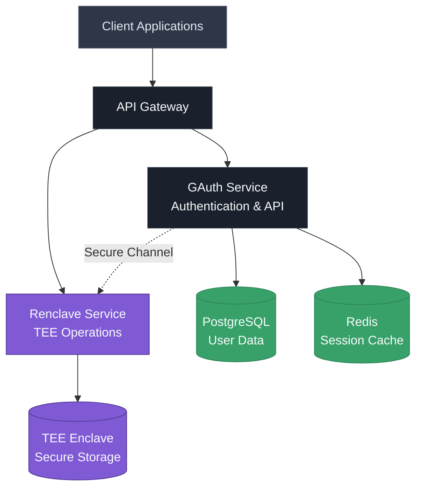
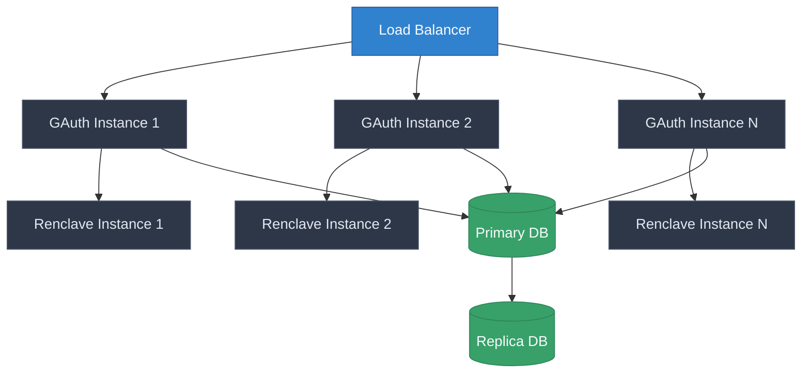

# Architecture Overview

TEE Auth is a secure authentication and transaction signing service that leverages Trusted Execution Environments (TEEs) to provide enhanced security for cryptographic operations. The system consists of two main components working together to provide a secure and scalable solution.

## System Architecture

The TEE Auth system follows a layered architecture with clear separation of concerns:

## Component Overview

### 1. **GAuth Service**
The authentication and API service written in Go that handles:
- User authentication and authorization
- API key management
- Organization and user management
- Wallet and private key metadata
- RESTful API endpoints

### 2. **Renclave Service**
The TEE enclave service written in Rust that provides:
- Secure cryptographic operations
- Private key storage and management
- Transaction signing within secure enclaves
- Hardware-backed security guarantees

### 3. **Data Storage**
- **PostgreSQL**: Stores user data, organizations, wallets, and metadata
- **Redis**: Handles session caching and temporary data
- **TEE Enclave**: Secure storage for private keys and sensitive data

## Security Model

The system implements a multi-layered security approach:

```mermaid
graph LR
    %% Dark mode styling
    classDef darkLayer fill:#2d3748,stroke:#4a5568,color:#e2e8f0
    classDef darkSecure fill:#805ad5,stroke:#553c9a,color:#f7fafc
    classDef darkHardware fill:#e53e3e,stroke:#c53030,color:#f7fafc
    
    %% Light mode styling
    classDef lightLayer fill:#f7fafc,stroke:#e2e8f0,color:#2d3748
    classDef lightSecure fill:#805ad5,stroke:#553c9a,color:#ffffff
    classDef lightHardware fill:#e53e3e,stroke:#c53030,color:#ffffff

    L1[Application Layer<br/>API Security]:::darkLayer
    L2[Transport Layer<br/>TLS/HTTPS]:::darkLayer
    L3[Authentication Layer<br/>X-Stamp Signing]:::darkSecure
    L4[TEE Layer<br/>Hardware Isolation]:::darkHardware
    L5[Hardware Layer<br/>CPU Security]:::darkHardware
    
    L1 --> L2
    L2 --> L3
    L3 --> L4
    L4 --> L5
    
    %% Apply theme classes
    class L1,L2,L3,L4,L5 darkLayer,darkSecure,darkHardware
```

## Data Flow

Here's how data flows through the system for a typical transaction signing operation:

```mermaid
sequenceDiagram
    participant Client
    participant API as API Gateway
    participant GAuth as GAuth Service
    participant Renclave as Renclave Service
    participant TEE as TEE Enclave
    participant DB as Database
    
    %% Dark mode styling
    rect rgb(45, 55, 72)
        Note over Client,DB: Transaction Signing Flow
    end
    
    Client->>API: Sign Transaction Request
    API->>GAuth: Validate Authentication
    GAuth->>DB: Verify User & Wallet
    DB-->>GAuth: User & Wallet Data
    GAuth-->>API: Authentication Valid
    API->>Renclave: Forward Signing Request
    Renclave->>TEE: Retrieve Private Key
    TEE-->>Renclave: Private Key (Secure)
    Renclave->>TEE: Sign Transaction
    TEE-->>Renclave: Signed Transaction
    Renclave-->>API: Signed Transaction
    API-->>Client: Transaction Response
```

## Key Security Features

### 🔐 **Multi-Factor Authentication**
- API key-based authentication
- X-Stamp cryptographic signing
- TOTP authenticators
- Recovery mechanisms

### 🛡️ **Hardware Security**
- Trusted Execution Environment (TEE)
- Hardware-backed key storage
- Secure enclave isolation
- Attestation verification

### 🔒 **Data Protection**
- End-to-end encryption
- Secure key derivation
- Zero-knowledge architecture
- Audit logging

### 🌐 **Network Security**
- TLS/HTTPS encryption
- Rate limiting
- DDoS protection
- Secure API design

## Scalability Considerations

The architecture is designed for horizontal scaling:

This architecture ensures high availability, fault tolerance, and the ability to handle increasing load while maintaining security guarantees.

