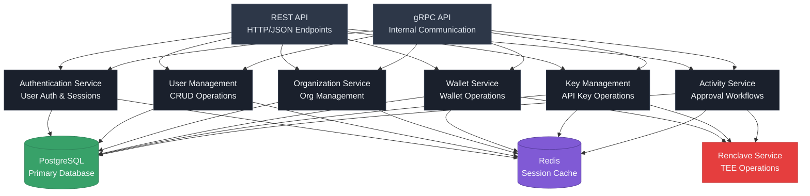
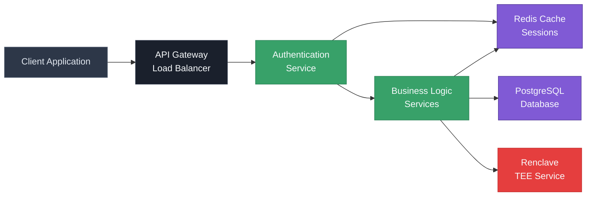
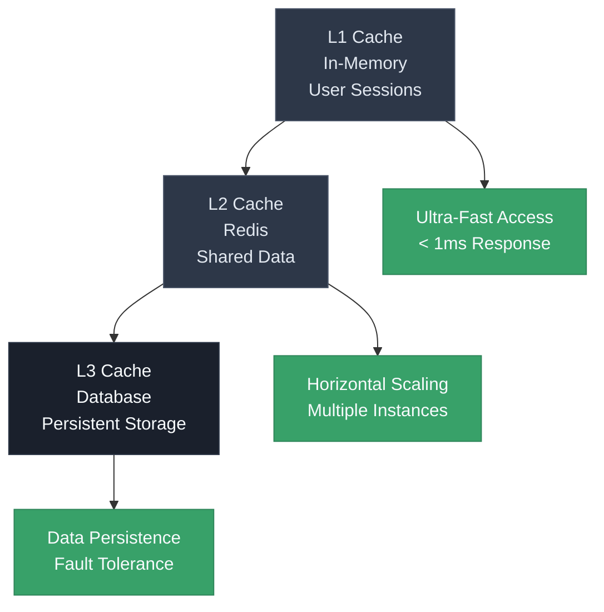
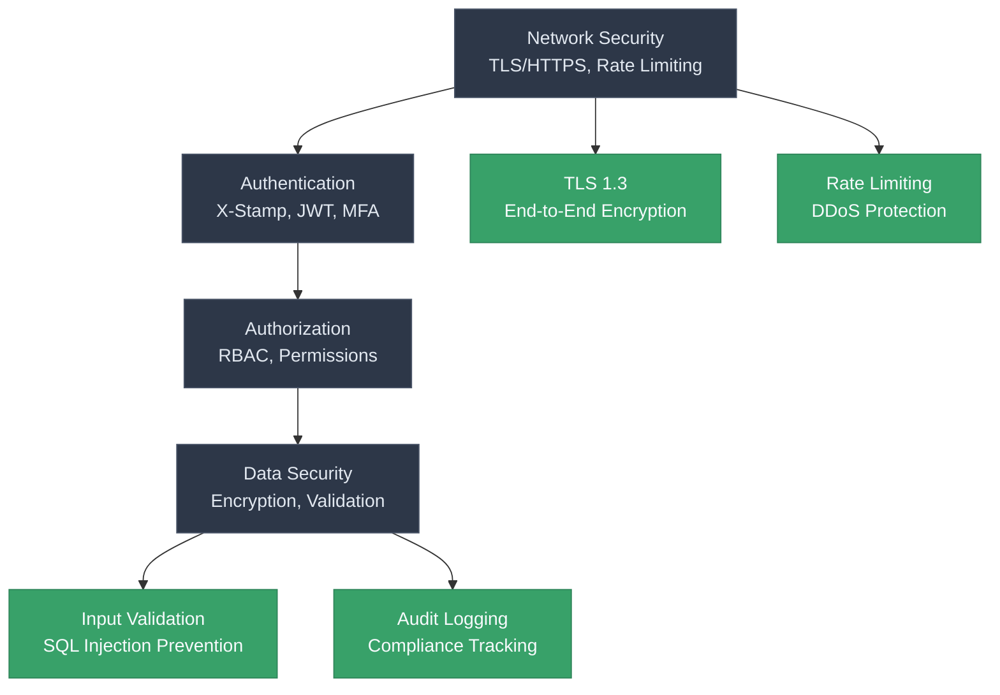
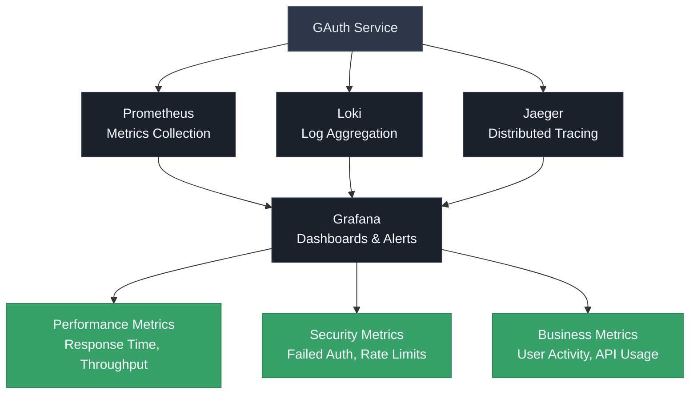
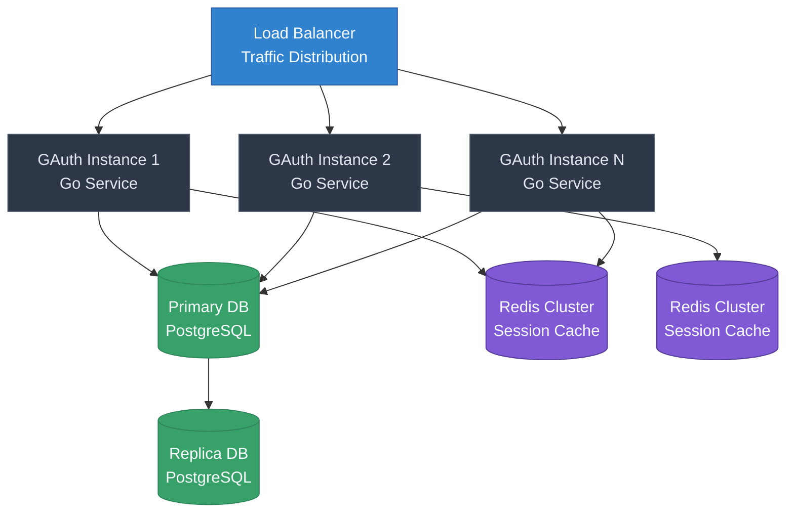

# GAuth Architecture

The GAuth service is the authentication and API management component of the TEE Auth system. Built in Go for performance and reliability, it handles user authentication, API key management, and provides the RESTful API interface for the entire system.

## GAuth Service Architecture

The GAuth service follows a clean, layered architecture designed for scalability and maintainability:



## Service Layer Details

### 1. **Authentication Service**
- User authentication and session management
- X-Stamp signature validation
- JWT token generation and validation
- Multi-factor authentication support
- Rate limiting and access control

### 2. **User Management Service**
- User CRUD operations
- Role-based access control (RBAC)
- User profile management
- Email verification and password reset
- User activity tracking

### 3. **Organization Service**
- Organization CRUD operations
- Organization hierarchy management
- User-organization relationships
- Organization settings and policies
- Billing and subscription management

### 4. **Wallet Service**
- Wallet CRUD operations
- Wallet metadata management
- Integration with Renclave for key operations
- Wallet usage analytics
- Backup and recovery coordination

### 5. **Key Management Service**
- API key generation and management
- Key rotation and revocation
- Usage tracking and analytics
- Security policy enforcement
- Integration with Renclave for key storage

### 6. **Activity Service**
- Activity approval workflows
- Audit logging and compliance
- Activity status tracking
- Notification management
- Integration with external systems

## Data Flow Architecture

The data flow through the GAuth service for different operations:



## Authentication Flow

The complete authentication and authorization flow:

```mermaid
sequenceDiagram
    participant Client
    participant Gateway as API Gateway
    participant Auth as Auth Service
    participant Cache as Redis Cache
    participant DB as Database
    participant TEE as Renclave Service
    
    %% Dark mode styling
    rect rgb(45, 55, 72)
        Note over Client,TEE: Authentication & Authorization Flow
    end
    
    Client->>Gateway: API Request with X-Stamp
    Gateway->>Auth: Validate X-Stamp Signature
    Auth->>Cache: Check Session Cache
    
    alt Session Found
        Auth-->>Gateway: Valid Session
    else Session Not Found
        Auth->>DB: Verify User & Permissions
        DB-->>Auth: User Data & Permissions
        Auth->>Cache: Store Session
        Auth-->>Gateway: Authentication Result
    end
    
    Gateway->>TEE: Forward Secure Operations
    TEE-->>Gateway: Operation Result
    Gateway-->>Client: API Response
```



## Database Schema Overview

The GAuth service uses a well-designed database schema:

```mermaid
erDiagram
    %% Dark mode styling
    classDef darkEntity fill:#2d3748,stroke:#4a5568,color:#e2e8f0
    classDef darkRelation fill:#1a202c,stroke:#2d3748,color:#f7fafc
    
    %% Light mode styling
    classDef lightEntity fill:#f7fafc,stroke:#e2e8f0,color:#2d3748
    classDef lightRelation fill:#ffffff,stroke:#e2e8f0,color:#2d3748

    ORGANIZATIONS {
        uuid id PK
        string name
        string email
        text description
        timestamp created_at
        timestamp updated_at
    }:::darkEntity
    
    USERS {
        uuid id PK
        uuid organization_id FK
        string email
        string name
        string role
        timestamp created_at
        timestamp updated_at
    }:::darkEntity
    
    WALLETS {
        uuid id PK
        uuid user_id FK
        string wallet_type
        string name
        text description
        string public_key
        timestamp created_at
        timestamp updated_at
    }:::darkEntity
    
    PRIVATE_KEYS {
        uuid id PK
        uuid wallet_id FK
        string key_type
        string name
        string public_key
        timestamp created_at
        timestamp updated_at
    }:::darkEntity
    
    API_KEYS {
        uuid id PK
        uuid user_id FK
        string name
        string public_key
        string private_key_hash
        timestamp created_at
        timestamp last_used_at
    }:::darkEntity
    
    ACTIVITIES {
        uuid id PK
        uuid user_id FK
        string activity_type
        string status
        json parameters
        timestamp created_at
        timestamp updated_at
    }:::darkEntity
    
    %% Relationships
    ORGANIZATIONS ||--o{ USERS : "has"
    USERS ||--o{ WALLETS : "owns"
    USERS ||--o{ API_KEYS : "has"
    USERS ||--o{ ACTIVITIES : "performs"
    WALLETS ||--o{ PRIVATE_KEYS : "contains"
    
    %% Apply theme classes
    class ORGANIZATIONS,USERS,WALLETS,PRIVATE_KEYS,API_KEYS,ACTIVITIES darkEntity
```

## Caching Strategy

GAuth implements a multi-level caching strategy for optimal performance:



## Security Architecture

GAuth implements comprehensive security measures:



## Monitoring and Observability

GAuth provides comprehensive monitoring and observability:



## Deployment Architecture

GAuth is designed for high availability and scalability:



This architecture ensures that the GAuth service provides reliable, scalable, and secure authentication and API management capabilities while maintaining high performance and availability.

