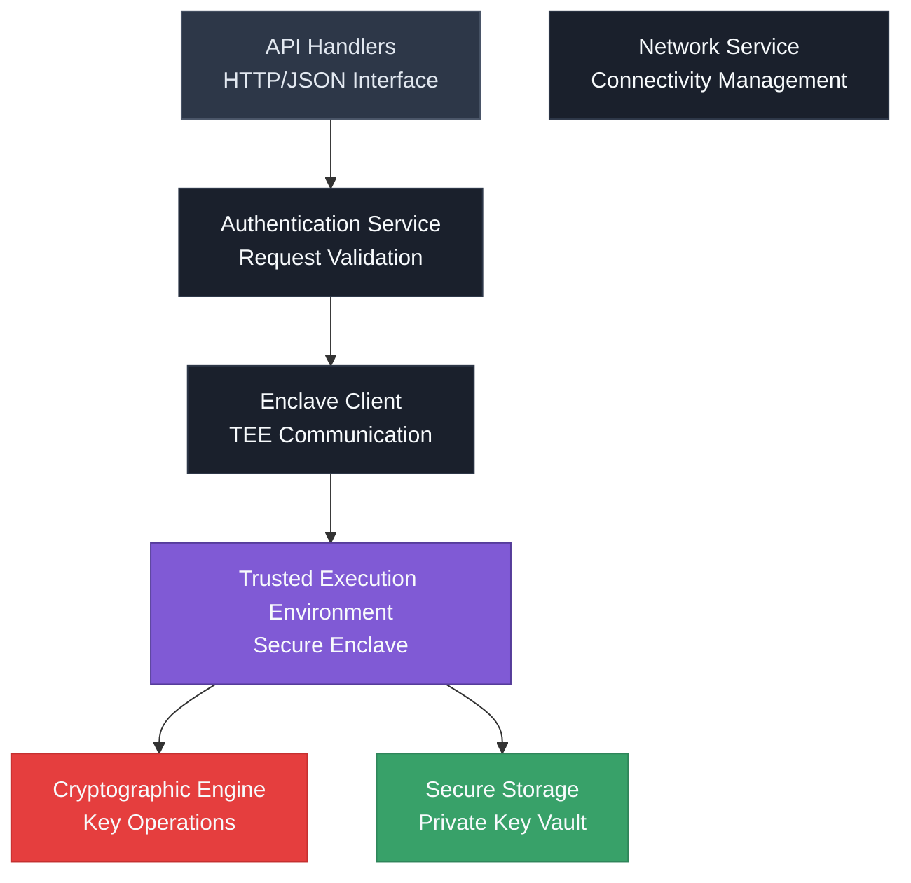
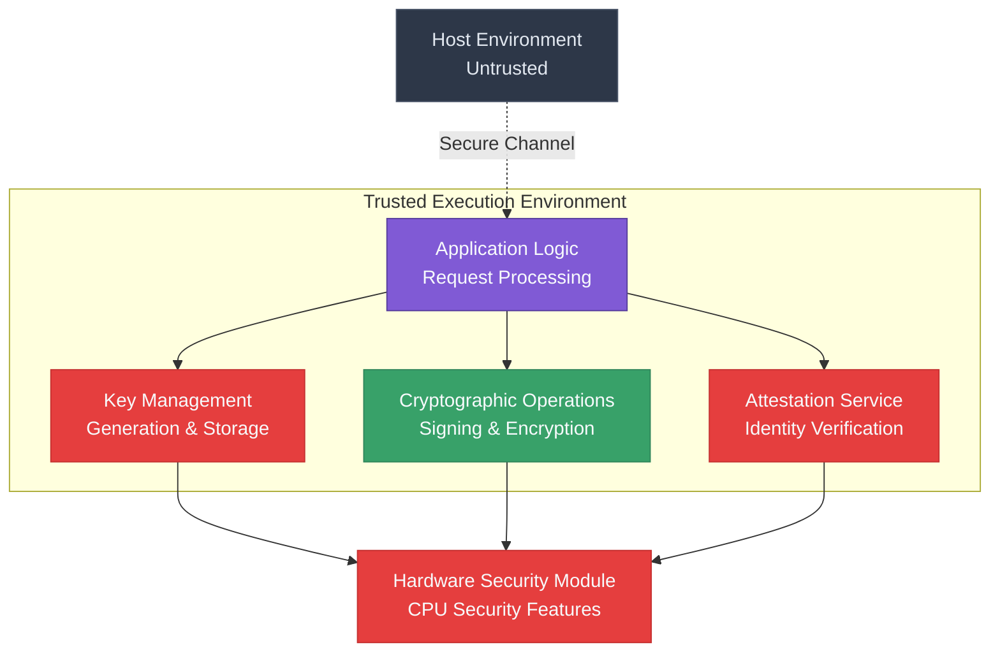
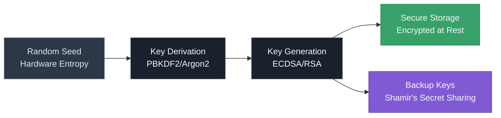
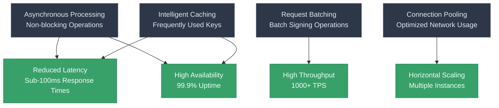
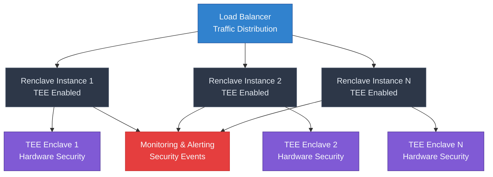

# Renclave Architecture

The Renclave service is the core component responsible for secure cryptographic operations within Trusted Execution Environments (TEEs). Built in Rust for performance and security, it provides hardware-backed security guarantees for private key management and transaction signing.

## Renclave Service Architecture

The Renclave service follows a modular architecture designed for security and performance:

## Component Details

### 1. **API Handlers**
- HTTP/JSON interface for external communication
- Request validation and sanitization
- Response formatting and error handling
- Rate limiting and access control

### 2. **Authentication Service**
- Validates incoming requests
- Verifies X-Stamp signatures
- Manages session tokens
- Implements access control policies

### 3. **Enclave Client**
- Manages communication with TEE
- Handles attestation verification
- Implements secure channel protocols
- Provides abstraction layer for TEE operations

### 4. **Network Service**
- Manages network connectivity
- Implements retry logic
- Handles connection pooling
- Provides monitoring and metrics

## TEE Enclave Architecture

The Trusted Execution Environment provides the secure foundation:

## Key Management Architecture

Private keys are managed securely within the TEE:

## Transaction Signing Flow

The complete flow for signing a transaction:

```mermaid
sequenceDiagram
    participant Client
    participant API as API Handler
    participant Auth as Auth Service
    participant Enclave as Enclave Client
    participant TEE as TEE Enclave
    participant Crypto as Crypto Engine
    
    %% Dark mode styling
    rect rgb(45, 55, 72)
        Note over Client,Crypto: Transaction Signing Process
    end
    
    Client->>API: Sign Transaction Request
    API->>Auth: Validate Request & Signature
    Auth-->>API: Authentication Result
    
    alt Authentication Success
        API->>Enclave: Forward Signing Request
        Enclave->>TEE: Retrieve Private Key
        TEE-->>Enclave: Private Key (Secure)
        Enclave->>TEE: Sign Transaction Data
        TEE->>Crypto: Perform Cryptographic Operation
        Crypto-->>TEE: Signed Transaction
        TEE-->>Enclave: Signed Transaction
        Enclave-->>API: Transaction Result
        API-->>Client: Success Response
    else Authentication Failed
        API-->>Client: Error Response
    end
```

## Security Features

### 🔐 **Hardware Security**
- **CPU Security**: Leverages Intel SGX or AMD SEV
- **Memory Protection**: Encrypted memory regions
- **Attestation**: Remote attestation for identity verification
- **Sealing**: Hardware-backed key sealing

### 🛡️ **Cryptographic Security**
- **Key Generation**: Hardware entropy sources
- **Key Storage**: Encrypted at rest within TEE
- **Key Derivation**: PBKDF2/Argon2 for key stretching
- **Backup**: Shamir's Secret Sharing for key recovery

### 🔒 **Operational Security**
- **Access Control**: Role-based permissions
- **Audit Logging**: Comprehensive security logs
- **Rate Limiting**: Protection against abuse
- **Monitoring**: Real-time security monitoring

## Performance Optimizations

The Renclave service is optimized for high-performance cryptographic operations:

## Deployment Architecture

The Renclave service can be deployed in various configurations:

This architecture ensures that the Renclave service provides secure, high-performance cryptographic operations while maintaining the highest levels of security through hardware-backed TEE technology.

