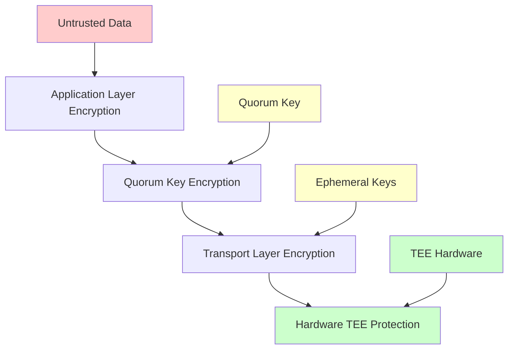

# Encryption & Decryption for Untrusted Data

This document provides a comprehensive guide to the encryption and decryption mechanisms used in the Renclave system for handling untrusted data, including the cryptographic algorithms, implementation details, and security considerations.

## Overview

The Renclave system implements a sophisticated encryption framework that protects sensitive data both within the TEE and during transmission between TEEs. The system uses multiple layers of encryption to ensure data confidentiality, integrity, and authenticity.

## Cryptographic Architecture

### Encryption Layers


### Key Hierarchy for Encryption
1. **Quorum Key**: Master encryption key (32 bytes, P-256)
2. **Derived Keys**: Application-specific keys derived from quorum key
3. **Ephemeral Keys**: Session-specific keys for TEE-to-TEE communication
4. **Seed Keys**: Keys derived for seed generation and cryptographic operations

## Encryption Algorithms

### 1. ECIES (Elliptic Curve Integrated Encryption Scheme)
**Purpose**: Primary encryption scheme for TEE-to-TEE communication
**Algorithm**: P-256 (secp256r1) Elliptic Curve
**Key Size**: 256-bit
**Usage**: Encrypting quorum keys for transfer between TEEs

#### ECIES Encryption Process
```rust
// ECIES encryption implementation
pub fn ecies_encrypt(plaintext: &[u8], public_key: &[u8]) -> Result<Vec<u8>> {
    // 1. Generate ephemeral key pair
    let ephemeral_private = generate_p256_private_key();
    let ephemeral_public = derive_public_key(&ephemeral_private);
    
    // 2. Generate shared secret using ECDH
    let shared_secret = ecdh_shared_secret(&ephemeral_private, public_key)?;
    
    // 3. Derive encryption key using HKDF
    let encryption_key = hkdf_expand(&shared_secret, b"renclave-ecies")?;
    
    // 4. Encrypt plaintext using AES-256-GCM
    let (ciphertext, tag) = aes_256_gcm_encrypt(plaintext, &encryption_key)?;
    
    // 5. Combine ephemeral public key + ciphertext + tag
    let mut encrypted_data = Vec::new();
    encrypted_data.extend_from_slice(&ephemeral_public);
    encrypted_data.extend_from_slice(&ciphertext);
    encrypted_data.extend_from_slice(&tag);
    
    Ok(encrypted_data)
}
```

#### ECIES Decryption Process
```rust
// ECIES decryption implementation
pub fn ecies_decrypt(encrypted_data: &[u8], private_key: &[u8]) -> Result<Vec<u8>> {
    // 1. Extract ephemeral public key (first 65 bytes)
    let ephemeral_public = &encrypted_data[..65];
    
    // 2. Extract ciphertext and tag
    let ciphertext = &encrypted_data[65..encrypted_data.len()-16];
    let tag = &encrypted_data[encrypted_data.len()-16..];
    
    // 3. Generate shared secret using ECDH
    let shared_secret = ecdh_shared_secret(private_key, ephemeral_public)?;
    
    // 4. Derive encryption key using HKDF
    let encryption_key = hkdf_expand(&shared_secret, b"renclave-ecies")?;
    
    // 5. Decrypt using AES-256-GCM
    let plaintext = aes_256_gcm_decrypt(ciphertext, &encryption_key, tag)?;
    
    Ok(plaintext)
}
```

### 2. AES-256-GCM (Advanced Encryption Standard with Galois/Counter Mode)
**Purpose**: Symmetric encryption for data protection
**Algorithm**: AES-256 in GCM mode
**Key Size**: 256-bit
**Usage**: Encrypting sensitive data within TEE operations

#### AES-256-GCM Implementation
```rust
// AES-256-GCM encryption
pub fn aes_256_gcm_encrypt(plaintext: &[u8], key: &[u8; 32]) -> Result<(Vec<u8>, [u8; 16])> {
    use aes_gcm::{Aes256Gcm, Key, Nonce};
    use aes_gcm::aead::{Aead, NewAead};
    
    // Generate random nonce
    let mut nonce_bytes = [0u8; 12];
    thread_rng().fill_bytes(&mut nonce_bytes);
    let nonce = Nonce::from_slice(&nonce_bytes);
    
    // Create cipher
    let key = Key::from_slice(key);
    let cipher = Aes256Gcm::new(key);
    
    // Encrypt
    let ciphertext = cipher.encrypt(nonce, plaintext)
        .map_err(|_| anyhow!("AES-GCM encryption failed"))?;
    
    Ok((ciphertext, nonce_bytes))
}

// AES-256-GCM decryption
pub fn aes_256_gcm_decrypt(
    ciphertext: &[u8], 
    key: &[u8; 32], 
    nonce: &[u8; 12]
) -> Result<Vec<u8>> {
    use aes_gcm::{Aes256Gcm, Key, Nonce};
    use aes_gcm::aead::{Aead, NewAead};
    
    // Create cipher
    let key = Key::from_slice(key);
    let cipher = Aes256Gcm::new(key);
    let nonce = Nonce::from_slice(nonce);
    
    // Decrypt
    let plaintext = cipher.decrypt(nonce, ciphertext)
        .map_err(|_| anyhow!("AES-GCM decryption failed"))?;
    
    Ok(plaintext)
}
```

### 3. HKDF (HMAC-based Key Derivation Function)
**Purpose**: Key derivation from shared secrets
**Algorithm**: HMAC-SHA256
**Usage**: Deriving encryption keys from quorum keys and shared secrets

#### HKDF Implementation
```rust
// HKDF key derivation
pub fn hkdf_expand(shared_secret: &[u8], info: &[u8]) -> Result<[u8; 32]> {
    use hkdf::Hkdf;
    use sha2::Sha256;
    
    let hkdf = Hkdf::<Sha256>::new(None, shared_secret);
    let mut derived_key = [0u8; 32];
    hkdf.expand(info, &mut derived_key)
        .map_err(|_| anyhow!("HKDF expansion failed"))?;
    
    Ok(derived_key)
}

// HKDF for seed generation
pub fn derive_seed_key(
    quorum_key: &[u8; 32],
    seed_type: &str,
    seed_data: &str
) -> Result<[u8; 32]> {
    let mut context = Vec::new();
    context.extend_from_slice(seed_type.as_bytes());
    context.extend_from_slice(seed_data.as_bytes());
    
    let hkdf = Hkdf::<Sha256>::new(None, quorum_key);
    let mut derived_key = [0u8; 32];
    hkdf.expand(&context, &mut derived_key)
        .map_err(|_| anyhow!("Seed key derivation failed"))?;
    
    Ok(derived_key)
}
```

### 4. P-256 Digital Signatures
**Purpose**: Data integrity and authenticity verification
**Algorithm**: ECDSA with P-256 curve
**Usage**: Signing encrypted data and attestation documents

#### Digital Signature Implementation
```rust
// P-256 signature generation
pub fn sign_with_quorum_key(
    data: &[u8],
    private_key: &[u8; 32]
) -> Result<[u8; 64]> {
    use p256::ecdsa::{SigningKey, Signature};
    use p256::ecdsa::signature::{Signer, DigestSigner};
    use sha2::Sha256;
    
    let signing_key = SigningKey::from_bytes(private_key)
        .map_err(|_| anyhow!("Invalid private key"))?;
    
    let signature: Signature = signing_key.sign(&Sha256::digest(data));
    
    Ok(signature.to_bytes())
}

// P-256 signature verification
pub fn verify_signature(
    data: &[u8],
    signature: &[u8; 64],
    public_key: &[u8; 32]
) -> Result<bool> {
    use p256::ecdsa::{VerifyingKey, Signature};
    use p256::ecdsa::signature::{Verifier, DigestVerifier};
    use sha2::Sha256;
    
    let verifying_key = VerifyingKey::from_sec1_bytes(public_key)
        .map_err(|_| anyhow!("Invalid public key"))?;
    
    let signature = Signature::from_bytes(signature)
        .map_err(|_| anyhow!("Invalid signature"))?;
    
    Ok(verifying_key.verify(&Sha256::digest(data), &signature).is_ok())
}
```

## Data Encryption Patterns

### 1. Seed Generation Encryption
**Purpose**: Encrypting seed generation data
**Pattern**: Quorum key → HKDF → AES-256-GCM

```rust
// Encrypt seed generation data
pub fn encrypt_seed_data(
    seed_data: &str,
    quorum_key: &[u8; 32]
) -> Result<Vec<u8>> {
    // Derive encryption key
    let encryption_key = derive_seed_key(
        quorum_key,
        "seed-encryption",
        "renclave-seed-data"
    )?;
    
    // Encrypt using AES-256-GCM
    let (ciphertext, nonce) = aes_256_gcm_encrypt(
        seed_data.as_bytes(),
        &encryption_key
    )?;
    
    // Combine nonce + ciphertext
    let mut encrypted_data = Vec::new();
    encrypted_data.extend_from_slice(&nonce);
    encrypted_data.extend_from_slice(&ciphertext);
    
    Ok(encrypted_data)
}
```

### 2. TEE-to-TEE Key Transfer Encryption
**Purpose**: Encrypting quorum keys for transfer between TEEs
**Pattern**: Quorum key → ECIES → Ephemeral key encryption

```rust
// Encrypt quorum key for TEE-to-TEE transfer
pub fn encrypt_quorum_key_for_transfer(
    quorum_key: &[u8; 32],
    target_tee_public_key: &[u8; 65]
) -> Result<(Vec<u8>, [u8; 64])> {
    // Encrypt using ECIES
    let encrypted_key = ecies_encrypt(quorum_key, target_tee_public_key)?;
    
    // Sign the encrypted key
    let signature = sign_with_quorum_key(&encrypted_key, &quorum_private_key)?;
    
    Ok((encrypted_key, signature))
}
```

### 3. Share Encryption
**Purpose**: Encrypting individual shares for distribution
**Pattern**: Share data → Member public key → ECIES encryption

```rust
// Encrypt share for member
pub fn encrypt_share_for_member(
    share_data: &[u8],
    member_public_key: &[u8; 65]
) -> Result<Vec<u8>> {
    // Encrypt share using ECIES
    let encrypted_share = ecies_encrypt(share_data, member_public_key)?;
    
    Ok(encrypted_share)
}

// Decrypt share for member
pub fn decrypt_share_for_member(
    encrypted_share: &[u8],
    member_private_key: &[u8; 32]
) -> Result<Vec<u8>> {
    // Decrypt share using ECIES
    let share_data = ecies_decrypt(encrypted_share, member_private_key)?;
    
    Ok(share_data)
}
```

### 4. Manifest Encryption
**Purpose**: Protecting manifest data during transmission
**Pattern**: Manifest → Quorum key → AES-256-GCM

```rust
// Encrypt manifest envelope
pub fn encrypt_manifest_envelope(
    manifest: &ManifestEnvelope,
    quorum_key: &[u8; 32]
) -> Result<Vec<u8>> {
    // Serialize manifest
    let manifest_bytes = borsh::to_vec(manifest)?;
    
    // Derive encryption key
    let encryption_key = hkdf_expand(
        quorum_key,
        b"renclave-manifest-encryption"
    )?;
    
    // Encrypt using AES-256-GCM
    let (ciphertext, nonce) = aes_256_gcm_encrypt(&manifest_bytes, &encryption_key)?;
    
    // Combine nonce + ciphertext
    let mut encrypted_manifest = Vec::new();
    encrypted_manifest.extend_from_slice(&nonce);
    encrypted_manifest.extend_from_slice(&ciphertext);
    
    Ok(encrypted_manifest)
}
```

## Untrusted Data Handling

### 1. Input Validation and Sanitization
**Purpose**: Ensure data integrity before encryption
**Process**: Validate → Sanitize → Encrypt

```rust
// Validate and sanitize untrusted input
pub fn validate_and_sanitize_input(
    input: &str,
    max_length: usize
) -> Result<String> {
    // Check length
    if input.len() > max_length {
        return Err(anyhow!("Input too long"));
    }
    
    // Check for null bytes
    if input.contains('\0') {
        return Err(anyhow!("Input contains null bytes"));
    }
    
    // Trim whitespace
    let sanitized = input.trim().to_string();
    
    // Check for empty input
    if sanitized.is_empty() {
        return Err(anyhow!("Empty input"));
    }
    
    Ok(sanitized)
}
```

### 2. Secure Memory Handling
**Purpose**: Protect sensitive data in memory
**Process**: Allocate → Use → Zeroize

```rust
// Secure memory handling
pub struct SecureBuffer {
    data: Vec<u8>,
}

impl SecureBuffer {
    pub fn new(size: usize) -> Self {
        let mut data = Vec::with_capacity(size);
        data.resize(size, 0);
        Self { data }
    }
    
    pub fn as_mut_slice(&mut self) -> &mut [u8] {
        &mut self.data
    }
    
    pub fn as_slice(&self) -> &[u8] {
        &self.data
    }
}

impl Drop for SecureBuffer {
    fn drop(&mut self) {
        // Zeroize memory on drop
        self.data.fill(0);
    }
}
```

### 3. Constant-Time Operations
**Purpose**: Prevent timing attacks
**Implementation**: Use constant-time comparison and operations

```rust
// Constant-time comparison
pub fn constant_time_compare(a: &[u8], b: &[u8]) -> bool {
    use subtle::ConstantTimeEq;
    a.ct_eq(b).into()
}

// Constant-time key validation
pub fn validate_key_constant_time(
    key: &[u8],
    expected_length: usize
) -> bool {
    if key.len() != expected_length {
        return false;
    }
    
    // Check for all zeros (weak key)
    let mut is_zero = true;
    for &byte in key {
        is_zero &= byte == 0;
    }
    
    !is_zero
}
```

## Encryption Workflows

### 1. Complete Seed Generation Workflow
```rust
// Complete seed generation with encryption
pub fn generate_encrypted_seed(
    seed_type: &str,
    seed_data: &str,
    quorum_key: &[u8; 32]
) -> Result<EncryptedSeed> {
    // 1. Validate inputs
    let validated_type = validate_and_sanitize_input(seed_type, 64)?;
    let validated_data = validate_and_sanitize_input(seed_data, 256)?;
    
    // 2. Derive seed generation key
    let seed_key = derive_seed_key(quorum_key, &validated_type, &validated_data)?;
    
    // 3. Generate random entropy
    let mut entropy = [0u8; 32];
    thread_rng().fill_bytes(&mut entropy);
    
    // 4. Encrypt entropy
    let (encrypted_entropy, nonce) = aes_256_gcm_encrypt(&entropy, &seed_key)?;
    
    // 5. Generate seed phrase
    let seed_phrase = generate_bip39_phrase(&entropy)?;
    
    // 6. Create encrypted seed
    Ok(EncryptedSeed {
        encrypted_entropy,
        nonce,
        seed_phrase,
        strength: 256,
        word_count: 24,
    })
}
```

### 2. TEE-to-TEE Communication Workflow
```rust
// Complete TEE-to-TEE communication workflow
pub async fn secure_tee_communication(
    source_tee: &TEEInstance,
    target_tee: &TEEInstance,
    data: &[u8]
) -> Result<Vec<u8>> {
    // 1. Generate ephemeral key pair
    let ephemeral_private = generate_p256_private_key();
    let ephemeral_public = derive_public_key(&ephemeral_private);
    
    // 2. Get target TEE's public key
    let target_public = target_tee.get_public_key()?;
    
    // 3. Encrypt data using ECIES
    let encrypted_data = ecies_encrypt(data, &target_public)?;
    
    // 4. Sign encrypted data
    let signature = sign_with_quorum_key(
        &encrypted_data,
        &source_tee.get_private_key()?
    )?;
    
    // 5. Send to target TEE
    let response = target_tee.receive_encrypted_data(
        &encrypted_data,
        &signature,
        &ephemeral_public
    ).await?;
    
    // 6. Decrypt response
    let decrypted_response = ecies_decrypt(&response, &ephemeral_private)?;
    
    Ok(decrypted_response)
}
```

### 3. Share Distribution Workflow
```rust
// Complete share distribution workflow
pub fn distribute_encrypted_shares(
    shares: &[QuorumKeyShare],
    member_keys: &[MemberKey]
) -> Result<Vec<EncryptedShare>> {
    let mut encrypted_shares = Vec::new();
    
    for (share, member_key) in shares.iter().zip(member_keys.iter()) {
        // 1. Serialize share data
        let share_bytes = borsh::to_vec(share)?;
        
        // 2. Encrypt share for member
        let encrypted_share_data = encrypt_share_for_member(
            &share_bytes,
            &member_key.public_key
        )?;
        
        // 3. Create encrypted share
        let encrypted_share = EncryptedShare {
            member_alias: share.member_alias.clone(),
            encrypted_share: encrypted_share_data,
            encryption_method: "ECIES-P256".to_string(),
        };
        
        encrypted_shares.push(encrypted_share);
    }
    
    Ok(encrypted_shares)
}
```

## Security Considerations

### 1. Key Management Security
- **Key Isolation**: Keys stored only in TEE-protected memory
- **Key Rotation**: Regular key rotation policies
- **Key Zeroization**: Proper key cleanup after use
- **Access Control**: Strict access controls for key operations

### 2. Cryptographic Security
- **Algorithm Strength**: Use of proven cryptographic algorithms
- **Key Sizes**: Sufficient key sizes for security (256-bit minimum)
- **Randomness**: Cryptographically secure random number generation
- **Constant Time**: Constant-time operations to prevent timing attacks

### 3. Implementation Security
- **Input Validation**: Comprehensive input validation
- **Error Handling**: Secure error handling without information leakage
- **Memory Management**: Secure memory allocation and cleanup
- **Code Review**: Regular security code reviews

### 4. Operational Security
- **Monitoring**: Comprehensive monitoring of encryption operations
- **Auditing**: Regular security audits
- **Incident Response**: Prepared incident response procedures
- **Updates**: Regular security updates and patches

## Performance Characteristics

### Encryption Performance Benchmarks
- **AES-256-GCM**: ~100MB/s per core
- **ECIES (P-256)**: ~1000 operations/second
- **HKDF**: ~10,000 derivations/second
- **ECDSA Sign/Verify**: ~2000 operations/second

### Memory Usage
- **Encryption Buffers**: 2x plaintext size
- **Key Storage**: 32-65 bytes per key
- **Ephemeral Keys**: ~100 bytes per session
- **Ciphertext Overhead**: ~16 bytes (AES-GCM tag) + nonce

### CPU Usage
- **Symmetric Encryption**: Low CPU overhead
- **Asymmetric Encryption**: Higher CPU overhead
- **Key Derivation**: Moderate CPU overhead
- **Signature Operations**: Moderate CPU overhead

## Testing and Validation

### 1. Cryptographic Testing
```bash
# Test encryption/decryption operations
cargo test encryption_tests

# Test key derivation
cargo test key_derivation_tests

# Test signature operations
cargo test signature_tests

# Test ECIES operations
cargo test ecies_tests
```

### 2. Security Testing
```bash
# Test for timing attacks
cargo test timing_attack_tests

# Test memory security
cargo test memory_security_tests

# Test input validation
cargo test input_validation_tests

# Test key zeroization
cargo test key_zeroization_tests
```

### 3. Performance Testing
```bash
# Benchmark encryption operations
cargo bench encryption_benchmarks

# Benchmark key operations
cargo bench key_operation_benchmarks

# Benchmark memory usage
cargo bench memory_usage_benchmarks
```

## Integration Examples

### 1. Application Integration
```rust
// Encrypt application data
pub fn encrypt_application_data(
    data: &[u8],
    application_key: &[u8; 32]
) -> Result<EncryptedData> {
    let (ciphertext, nonce) = aes_256_gcm_encrypt(data, application_key)?;
    
    Ok(EncryptedData {
        ciphertext,
        nonce,
        algorithm: "AES-256-GCM".to_string(),
    })
}

// Decrypt application data
pub fn decrypt_application_data(
    encrypted_data: &EncryptedData,
    application_key: &[u8; 32]
) -> Result<Vec<u8>> {
    aes_256_gcm_decrypt(
        &encrypted_data.ciphertext,
        application_key,
        &encrypted_data.nonce
    )
}
```

### 2. Database Integration
```rust
// Encrypt database fields
pub fn encrypt_database_field(
    field_value: &str,
    field_key: &[u8; 32]
) -> Result<String> {
    let (ciphertext, nonce) = aes_256_gcm_encrypt(
        field_value.as_bytes(),
        field_key
    )?;
    
    // Encode as base64 for database storage
    let mut encoded_data = Vec::new();
    encoded_data.extend_from_slice(&nonce);
    encoded_data.extend_from_slice(&ciphertext);
    
    Ok(base64::encode(encoded_data))
}
```

### 3. API Integration
```rust
// Encrypt API responses
pub fn encrypt_api_response(
    response_data: &serde_json::Value,
    client_public_key: &[u8; 65]
) -> Result<EncryptedResponse> {
    let response_bytes = serde_json::to_vec(response_data)?;
    let encrypted_data = ecies_encrypt(&response_bytes, client_public_key)?;
    
    Ok(EncryptedResponse {
        encrypted_data,
        encryption_method: "ECIES-P256".to_string(),
        timestamp: SystemTime::now().duration_since(UNIX_EPOCH)?.as_secs(),
    })
}
```

## Troubleshooting

### Common Encryption Issues

#### 1. "Encryption failed"
**Cause**: Invalid key format or insufficient resources
**Solution**: Verify key format and available memory

#### 2. "Decryption failed"
**Cause**: Wrong key, corrupted data, or invalid format
**Solution**: Verify key correctness and data integrity

#### 3. "Key derivation failed"
**Cause**: Invalid input parameters or insufficient entropy
**Solution**: Verify input parameters and entropy source

#### 4. "Signature verification failed"
**Cause**: Invalid signature, wrong key, or corrupted data
**Solution**: Verify signature format and key correctness

### Debug Tools
```bash
# Encryption debug tool
cargo run --bin encryption_debug -- --data "test data" --key "key"

# Key validation tool
cargo run --bin key_validator -- --key-file key.json

# Performance profiler
cargo run --bin encryption_profiler -- --iterations 1000
```

## Best Practices

### 1. Encryption Best Practices
- **Use Strong Algorithms**: AES-256-GCM, P-256, SHA-256
- **Proper Key Management**: Secure key storage and rotation
- **Random Nonces**: Use cryptographically secure random nonces
- **Constant Time**: Use constant-time operations where applicable

### 2. Implementation Best Practices
- **Input Validation**: Validate all inputs before encryption
- **Error Handling**: Handle errors securely without information leakage
- **Memory Management**: Proper memory allocation and cleanup
- **Code Review**: Regular security code reviews

### 3. Operational Best Practices
- **Monitoring**: Monitor encryption operations and performance
- **Auditing**: Regular security audits and penetration testing
- **Updates**: Keep cryptographic libraries updated
- **Documentation**: Maintain comprehensive documentation

## Next Steps

After implementing encryption/decryption:
1. **Integration**: Integrate with your application
2. **Testing**: Comprehensive testing and validation
3. **Security Review**: Security review and penetration testing
4. **Monitoring**: Set up monitoring and alerting
5. **Documentation**: Document your specific implementation

For more details, see:
- [Key Management](./key-management.md)
- [TEE-to-TEE Key Sharing](./tee-to-tee-sharing.md)
- [Architecture Overview](./architecture.md)
