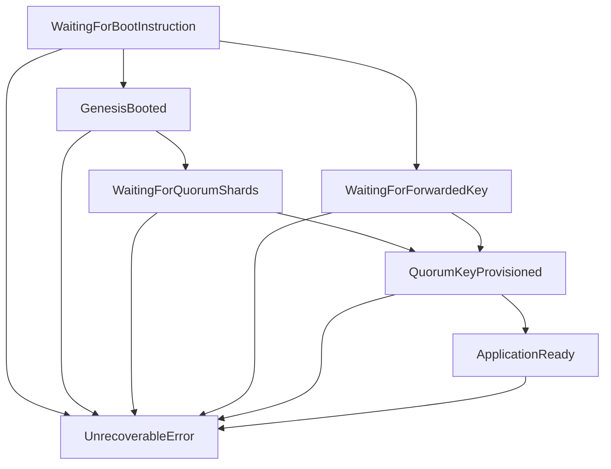

# TEE Instance Management

This document covers the complete process of setting up and managing single and multiple TEE instances, including the step-by-step procedures for different scenarios.

## Overview

The Renclave system supports both single-instance and multi-instance deployments. Each TEE instance operates independently but can communicate securely with other instances through the TEE-to-TEE key sharing mechanism.

## Single TEE Instance Setup

### Step 1: Container Startup
```bash
# Start single TEE container
docker run -d \
  --name renclave-v2-tee1 \
  --network docker_renclave-net \
  -p 9000:8080 \
  -e RUST_LOG=debug \
  --privileged \
  -v /dev/net/tun:/dev/net/tun \
  --cap-add NET_ADMIN \
  --cap-add SYS_ADMIN \
  --cap-add SYS_PTRACE \
  --device /dev/kvm \
  docker-renclave-v2 \
  /app/scripts/start-services.sh
```

**Container Configuration:**
- **Port Mapping**: `9000:8080` (host:container)
- **Network**: `docker_renclave-net` for inter-container communication
- **Privileges**: Required for TEE hardware access
- **Volumes**: Network tunnel device for secure communication
- **Capabilities**: Administrative privileges for TEE operations

### Step 2: Health Check
```bash
# Wait for container startup
sleep 30

# Verify container is running
docker ps | grep renclave

# Test health endpoint
curl -s -X GET http://localhost:9000/health
```

### Step 3: Genesis Boot
```bash
# Generate dynamic keys
cargo run --bin genesis_key_generator -- \
  --member-count 3 \
  --threshold 2 \
  --output /tmp/genesis_request.json

# Perform Genesis Boot
GENESIS_RESPONSE=$(curl -s -X POST http://localhost:9000/enclave/genesis-boot \
  -H "Content-Type: application/json" \
  -d @/tmp/genesis_request.json)
```

### Step 4: Share Injection
```bash
# Extract encrypted shares
SHARE1=$(echo "$GENESIS_RESPONSE" | jq -r '.encrypted_shares[0].encrypted_quorum_key_share')
SHARE2=$(echo "$GENESIS_RESPONSE" | jq -r '.encrypted_shares[1].encrypted_quorum_key_share')
SHARE3=$(echo "$GENESIS_RESPONSE" | jq -r '.encrypted_shares[2].encrypted_quorum_key_share')

# Inject shares
curl -s -X POST http://localhost:9000/enclave/inject-shares \
  -H "Content-Type: application/json" \
  -d "{
    \"namespace_name\": \"qos-namespace\",
    \"namespace_nonce\": 12345,
    \"shares\": [
      {
        \"member_alias\": \"member1\",
        \"decrypted_share\": $SHARE1
      },
      {
        \"member_alias\": \"member2\",
        \"decrypted_share\": $SHARE2
      }
    ]
  }"
```

### Step 5: Seed Generation Test
```bash
# Test seed generation
curl -s -X POST http://localhost:9000/generate-seed \
  -H "Content-Type: application/json" \
  -d '{
    "seed_type": "test-seed",
    "seed_data": "test-data"
  }' | jq .
```

## Multi-TEE Instance Setup

### Scenario 1: TEE1 → TEE2 Key Sharing

#### Step 1: Start Both Containers
```bash
# TEE1 (already running from single instance setup)
# TEE2
docker run -d \
  --name renclave-v2-tee2 \
  --network docker_renclave-net \
  -p 9001:8080 \
  -e RUST_LOG=debug \
  --privileged \
  -v /dev/net/tun:/dev/net/tun \
  --cap-add NET_ADMIN \
  --cap-add SYS_ADMIN \
  --cap-add SYS_PTRACE \
  --device /dev/kvm \
  docker-renclave-v2 \
  /app/scripts/start-services.sh
```

#### Step 2: Complete TEE1 Setup
```bash
# Ensure TEE1 is fully configured (Genesis Boot + Share Injection)
# (Steps from single instance setup)
```

#### Step 3: Share Manifest to TEE2
```bash
# Extract manifest envelope from TEE1 Genesis Boot response
MANIFEST_ENVELOPE=$(echo "$GENESIS_RESPONSE" | jq -r '.manifest_envelope')

# Share manifest with TEE2
curl -s -X POST http://localhost:9001/enclave/share-manifest \
  -H "Content-Type: application/json" \
  -d "{
    \"manifest_envelope\": $MANIFEST_ENVELOPE
  }"
```

#### Step 4: Generate TEE2 Attestation
```bash
# Generate attestation document for TEE2
ATTESTATION_RESPONSE=$(curl -s -X POST http://localhost:9001/enclave/generate-attestation \
  -H "Content-Type: application/json" \
  -d '{
    "manifest_hash": [0,0,0,0,0,0,0,0,0,0,0,0,0,0,0,0,0,0,0,0,0,0,0,0,0,0,0,0,0,0,0,0],
    "pcr_values": [[],[],[],[]]
  }')
```

#### Step 5: Export Key from TEE1 to TEE2
```bash
# Extract attestation document
ATTESTATION_DOC=$(echo "$ATTESTATION_RESPONSE" | jq '.result.GenerateAttestationResponse.attestation_doc')

# Export key from TEE1 to TEE2
EXPORT_RESPONSE=$(curl -s -X POST http://localhost:9000/enclave/export-key \
  -H "Content-Type: application/json" \
  -d "{
    \"manifest_envelope\": $MANIFEST_ENVELOPE,
    \"attestation_doc\": $ATTESTATION_DOC
  }")
```

#### Step 6: Inject Key into TEE2
```bash
# Extract encrypted key and signature
ENCRYPTED_KEY=$(echo "$EXPORT_RESPONSE" | jq '.result.ExportKeyResponse.encrypted_quorum_key')
SIGNATURE=$(echo "$EXPORT_RESPONSE" | jq '.result.ExportKeyResponse.signature')

# Inject key into TEE2
curl -s -X POST http://localhost:9001/enclave/inject-key \
  -H "Content-Type: application/json" \
  -d "{
    \"encrypted_quorum_key\": $ENCRYPTED_KEY,
    \"signature\": $SIGNATURE
  }"
```

#### Step 7: Test TEE2 Seed Generation
```bash
# Test seed generation in TEE2
curl -s -X POST http://localhost:9001/generate-seed \
  -H "Content-Type: application/json" \
  -d '{
    "seed_type": "tee2-seed",
    "seed_data": "tee2-test-data"
  }' | jq .
```

### Scenario 2: TEE1 → TEE2 → TEE3 Chain

#### Step 1: Start TEE3
```bash
docker run -d \
  --name renclave-v2-tee3 \
  --network docker_renclave-net \
  -p 9002:8080 \
  -e RUST_LOG=debug \
  --privileged \
  -v /dev/net/tun:/dev/net/tun \
  --cap-add NET_ADMIN \
  --cap-add SYS_ADMIN \
  --cap-add SYS_PTRACE \
  --device /dev/kvm \
  docker-renclave-v2 \
  /app/scripts/start-services.sh
```

#### Step 2: Share Manifest from TEE2 to TEE3
```bash
# Use the same manifest envelope from TEE1
curl -s -X POST http://localhost:9002/enclave/share-manifest \
  -H "Content-Type: application/json" \
  -d "{
    \"manifest_envelope\": $MANIFEST_ENVELOPE
  }"
```

#### Step 3: Generate TEE3 Attestation
```bash
ATTESTATION_RESPONSE_TEE3=$(curl -s -X POST http://localhost:9002/enclave/generate-attestation \
  -H "Content-Type: application/json" \
  -d '{
    "manifest_hash": [0,0,0,0,0,0,0,0,0,0,0,0,0,0,0,0,0,0,0,0,0,0,0,0,0,0,0,0,0,0,0,0],
    "pcr_values": [[],[],[],[]]
  }')
```

#### Step 4: Export Key from TEE2 to TEE3
```bash
ATTESTATION_DOC_TEE3=$(echo "$ATTESTATION_RESPONSE_TEE3" | jq '.result.GenerateAttestationResponse.attestation_doc')

EXPORT_RESPONSE_TEE3=$(curl -s -X POST http://localhost:9001/enclave/export-key \
  -H "Content-Type: application/json" \
  -d "{
    \"manifest_envelope\": $MANIFEST_ENVELOPE,
    \"attestation_doc\": $ATTESTATION_DOC_TEE3
  }")
```

#### Step 5: Inject Key into TEE3
```bash
ENCRYPTED_KEY_TEE3=$(echo "$EXPORT_RESPONSE_TEE3" | jq '.result.ExportKeyResponse.encrypted_quorum_key')
SIGNATURE_TEE3=$(echo "$EXPORT_RESPONSE_TEE3" | jq '.result.ExportKeyResponse.signature')

curl -s -X POST http://localhost:9002/enclave/inject-key \
  -H "Content-Type: application/json" \
  -d "{
    \"encrypted_quorum_key\": $ENCRYPTED_KEY_TEE3,
    \"signature\": $SIGNATURE_TEE3
  }"
```

#### Step 6: Test TEE3 Seed Generation
```bash
curl -s -X POST http://localhost:9002/generate-seed \
  -H "Content-Type: application/json" \
  -d '{
    "seed_type": "tee3-seed",
    "seed_data": "tee3-test-data"
  }' | jq .
```

## Threshold Configurations

### 2-out-of-3 Threshold
```bash
# Generate keys for 2-out-of-3
cargo run --bin genesis_key_generator -- \
  --member-count 3 \
  --threshold 2 \
  --output /tmp/genesis_request_2of3.json
```

### 7-out-of-7 Threshold (Maximum Security)
```bash
# Generate keys for 7-out-of-7
cargo run --bin genesis_key_generator -- \
  --member-count 7 \
  --threshold 7 \
  --output /tmp/genesis_request_7of7.json
```

### 3-out-of-5 Threshold (Enterprise)
```bash
# Generate keys for 3-out-of-5
cargo run --bin genesis_key_generator -- \
  --member-count 5 \
  --threshold 3 \
  --output /tmp/genesis_request_3of5.json
```

## Container Management

### Starting Containers
```bash
# Single container
docker run -d --name renclave-v2-tee1 -p 9000:8080 docker-renclave-v2

# Multiple containers with different ports
docker run -d --name renclave-v2-tee2 -p 9001:8080 docker-renclave-v2
docker run -d --name renclave-v2-tee3 -p 9002:8080 docker-renclave-v2
```

### Container Networking
```bash
# Create network for TEE communication
docker network create docker_renclave-net

# Start containers with network
docker run -d --network docker_renclave-net renclave-v2-tee1
```

### Health Monitoring
```bash
# Check container status
docker ps | grep renclave

# Test health endpoints
curl http://localhost:9000/health  # TEE1
curl http://localhost:9001/health  # TEE2
curl http://localhost:9002/health  # TEE3
```

### Cleanup
```bash
# Stop and remove containers
docker stop renclave-v2-tee1 renclave-v2-tee2 renclave-v2-tee3
docker rm renclave-v2-tee1 renclave-v2-tee2 renclave-v2-tee3

# Remove network
docker network rm docker_renclave-net
```

## State Management

### TEE States
1. **UnrecoverableError**: Critical failure state
2. **WaitingForBootInstruction**: Ready for Genesis Boot
3. **GenesisBooted**: Genesis Boot completed
4. **WaitingForQuorumShards**: Waiting for share injection
5. **WaitingForForwardedKey**: Ready for key injection from another TEE
6. **QuorumKeyProvisioned**: Key reconstruction successful
7. **ApplicationReady**: Ready for operations

### State Transitions


## Testing Procedures

### Single Instance Test
```bash
# Complete single TEE test
./test_complete_tee_flow.sh
```

### Multi-Instance Test
```bash
# TEE-to-TEE communication test
./test_tee_to_tee_key_sharing.sh
```

### Chain Test
```bash
# TEE1 → TEE2 → TEE3 chain test
./test_tee_chain.sh
```

### Threshold Test
```bash
# Different threshold configurations
./test_threshold_configurations.sh
```

## Troubleshooting

### Common Issues

#### Container Startup Failures
```bash
# Check Docker daemon
docker info

# Verify TEE hardware support
ls /dev/kvm

# Check network configuration
docker network ls
```

#### Genesis Boot Failures
```bash
# Verify key format
cat /tmp/genesis_request.json | jq '.parameters.manifest_members[0].pub_key'

# Check namespace uniqueness
# Ensure unique namespace_name and namespace_nonce
```

#### Share Injection Failures
```bash
# Verify share format
echo "$SHARE1" | jq 'length'

# Check threshold requirements
# Ensure enough shares for threshold
```

#### TEE-to-TEE Communication Failures
```bash
# Verify manifest sharing
curl -s http://localhost:9001/enclave/share-manifest

# Check attestation generation
curl -s http://localhost:9001/enclave/generate-attestation
```

### Debug Logging
```bash
# Enable debug logging
export RUST_LOG=debug

# View container logs
docker logs renclave-v2-tee1
docker logs renclave-v2-tee2
```

## Performance Considerations

### Container Resources
- **CPU**: 2 vCPUs recommended per TEE
- **Memory**: 7GB RAM per TEE container
- **Storage**: SSD recommended for performance
- **Network**: Low-latency network for TEE-to-TEE communication

### Scaling Considerations
- **Horizontal Scaling**: Add more TEE instances
- **Vertical Scaling**: Increase container resources
- **Network Optimization**: Use dedicated networks for TEE communication
- **Load Balancing**: Distribute requests across multiple TEEs

## Security Considerations

### Container Security
- **Privileged Mode**: Required for TEE hardware access
- **Capabilities**: Minimal required capabilities
- **Network Isolation**: Dedicated networks for TEE communication
- **Resource Limits**: Prevent resource exhaustion attacks

### TEE Security
- **Hardware Attestation**: Verify TEE integrity
- **Key Isolation**: Keys isolated within TEE
- **Secure Communication**: Encrypted TEE-to-TEE communication
- **State Verification**: Verify TEE state transitions

## Next Steps

After setting up TEE instances:
1. **Application Integration**: Integrate with your application
2. **Monitoring Setup**: Implement monitoring and alerting
3. **Backup Procedures**: Establish backup and recovery procedures
4. **Security Auditing**: Regular security audits and updates

For more details, see:
- [Key Management](./key-management.md)
- [TEE-to-TEE Key Sharing](./tee-to-tee-sharing.md)
- [Architecture Overview](./architecture.md)
