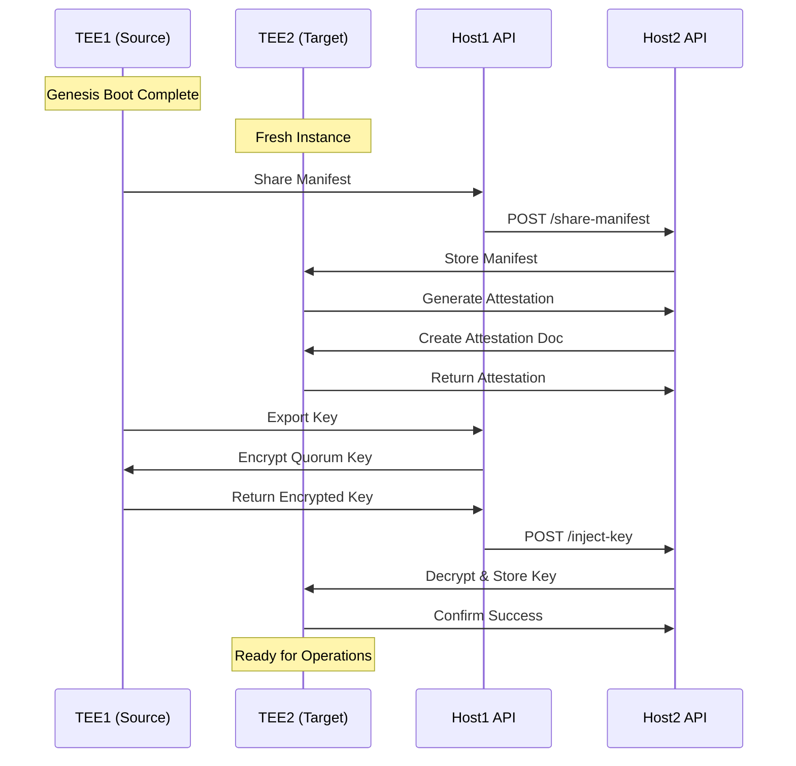

# TEE-to-TEE Key Sharing

This document provides a comprehensive guide to the TEE-to-TEE key sharing mechanism, including the complete process, security considerations, and implementation details.

## Overview

TEE-to-TEE key sharing enables secure transfer of quorum keys between different Trusted Execution Environment instances. This mechanism allows multiple TEEs to share the same cryptographic foundation while maintaining security through attestation-based verification.

## Architecture

### Key Sharing Flow


## Prerequisites

### Source TEE (TEE1) Requirements
- ✅ **Genesis Boot Completed**: TEE1 must have completed Genesis Boot
- ✅ **Share Injection Completed**: All required shares must be injected
- ✅ **Quorum Key Available**: Quorum key must be reconstructed and available
- ✅ **Application Ready State**: TEE1 must be in `ApplicationReady` state

### Target TEE (TEE2) Requirements
- ✅ **Container Started**: TEE2 container must be running
- ✅ **Health Check Passed**: TEE2 must be healthy and responsive
- ✅ **Waiting for Manifest**: TEE2 must be in `WaitingForBootInstruction` state
- ✅ **Network Connectivity**: TEE2 must be reachable via HTTP API

## Step-by-Step Process

### Step 1: Source TEE Setup Verification

#### Verify TEE1 Status
```bash
# Check TEE1 container status
docker ps | grep renclave-v2-tee1

# Test health endpoint
curl -s -X GET http://localhost:9000/health

# Verify TEE1 is ready for operations
curl -s -X POST http://localhost:9000/generate-seed \
  -H "Content-Type: application/json" \
  -d '{"seed_type": "test", "seed_data": "test"}' | jq .
```

#### Ensure TEE1 Has Quorum Key
```bash
# TEE1 should successfully generate seeds if quorum key is available
# If this fails, TEE1 needs Genesis Boot + Share Injection
```

### Step 2: Target TEE Setup

#### Start TEE2 Container
```bash
docker run -d \
  --name renclave-v2-tee2 \
  --network docker_renclave-net \
  -p 9001:8080 \
  -e RUST_LOG=debug \
  --privileged \
  -v /dev/net/tun:/dev/net/tun \
  --cap-add NET_ADMIN \
  --cap-add SYS_ADMIN \
  --cap-add SYS_PTRACE \
  --device /dev/kvm \
  docker-renclave-v2 \
  /app/scripts/start-services.sh
```

#### Wait for TEE2 Startup
```bash
# Wait for container to start
sleep 30

# Verify TEE2 is running
docker ps | grep renclave-v2-tee2

# Test health endpoint
curl -s -X GET http://localhost:9001/health
```

### Step 3: Manifest Sharing

#### Extract Manifest from TEE1
```bash
# Get manifest envelope from TEE1 Genesis Boot response
MANIFEST_ENVELOPE=$(echo "$GENESIS_RESPONSE" | jq -r '.manifest_envelope')

# Verify manifest envelope format
echo "$MANIFEST_ENVELOPE" | jq 'keys'
```

#### Share Manifest with TEE2
```bash
# Share manifest envelope with TEE2
curl -s -X POST http://localhost:9001/enclave/share-manifest \
  -H "Content-Type: application/json" \
  -d "{
    \"manifest_envelope\": $MANIFEST_ENVELOPE
  }" | jq .
```

**Expected Response:**
```json
{
  "id": "request-uuid",
  "result": {
    "ShareManifestResponse": {
      "success": true
    }
  }
}
```

#### State Transition Verification
After manifest sharing, TEE2 transitions from `WaitingForBootInstruction` to `WaitingForForwardedKey`:

```rust
// In ShareManifest handler
let mut state_manager = self.state_manager.lock().unwrap();
state_manager.transition_to(ApplicationPhase::WaitingForForwardedKey)?;
```

### Step 4: Attestation Generation

#### Generate Attestation Document for TEE2
```bash
# Generate attestation document for TEE2
ATTESTATION_RESPONSE=$(curl -s -X POST http://localhost:9001/enclave/generate-attestation \
  -H "Content-Type: application/json" \
  -d '{
    "manifest_hash": [0,0,0,0,0,0,0,0,0,0,0,0,0,0,0,0,0,0,0,0,0,0,0,0,0,0,0,0,0,0,0,0],
    "pcr_values": [[],[],[],[]]
  }')
```

**Expected Response:**
```json
{
  "id": "request-uuid",
  "result": {
    "GenerateAttestationResponse": {
      "attestation_doc": [/* Array of bytes representing attestation document */]
    }
  }
}
```

#### Extract Attestation Document
```bash
# Extract attestation document bytes
ATTESTATION_DOC=$(echo "$ATTESTATION_RESPONSE" | jq '.result.GenerateAttestationResponse.attestation_doc')

# Verify attestation document format
echo "$ATTESTATION_DOC" | jq 'length'
```

### Step 5: Key Export

#### Export Quorum Key from TEE1
```bash
# Export quorum key from TEE1 to TEE2
EXPORT_RESPONSE=$(curl -s -X POST http://localhost:9000/enclave/export-key \
  -H "Content-Type: application/json" \
  -d "{
    \"manifest_envelope\": $MANIFEST_ENVELOPE,
    \"attestation_doc\": $ATTESTATION_DOC
  }")
```

**Expected Response:**
```json
{
  "id": "request-uuid",
  "result": {
    "ExportKeyResponse": {
      "encrypted_quorum_key": [/* Array of bytes - encrypted quorum key */],
      "signature": [/* Array of bytes - signature of encrypted key */]
    }
  }
}
```

#### Extract Encrypted Key and Signature
```bash
# Extract encrypted quorum key
ENCRYPTED_KEY=$(echo "$EXPORT_RESPONSE" | jq '.result.ExportKeyResponse.encrypted_quorum_key')

# Extract signature
SIGNATURE=$(echo "$EXPORT_RESPONSE" | jq '.result.ExportKeyResponse.signature')

# Verify format
echo "Encrypted key length: $(echo "$ENCRYPTED_KEY" | jq 'length')"
echo "Signature length: $(echo "$SIGNATURE" | jq 'length')"
```

### Step 6: Key Injection

#### Inject Key into TEE2
```bash
# Inject encrypted quorum key into TEE2
curl -s -X POST http://localhost:9001/enclave/inject-key \
  -H "Content-Type: application/json" \
  -d "{
    \"encrypted_quorum_key\": $ENCRYPTED_KEY,
    \"signature\": $SIGNATURE
  }" | jq .
```

**Expected Response:**
```json
{
  "id": "request-uuid",
  "result": {
    "InjectKeyResponse": {
      "success": true
    }
  }
}
```

#### State Transition Verification
After key injection, TEE2 transitions through:
1. `WaitingForForwardedKey` → `QuorumKeyProvisioned`
2. `QuorumKeyProvisioned` → `ApplicationReady`

```rust
// In InjectKey handler
let mut state_manager = self.state_manager.lock().unwrap();
state_manager.transition_to(ApplicationPhase::QuorumKeyProvisioned)?;
state_manager.transition_to(ApplicationPhase::ApplicationReady)?;
```

### Step 7: Verification and Testing

#### Test TEE2 Seed Generation
```bash
# Test seed generation in TEE2
curl -s -X POST http://localhost:9001/generate-seed \
  -H "Content-Type: application/json" \
  -d '{
    "seed_type": "tee2-shared-seed",
    "seed_data": "tee2-test-data"
  }' | jq .
```

**Expected Response:**
```json
{
  "seed_phrase": "abandon abandon abandon ... (24 words)",
  "entropy": "64-character hex string",
  "strength": 256,
  "word_count": 24
}
```

#### Verify Both TEEs Are Operational
```bash
# Test TEE1 seed generation
curl -s -X POST http://localhost:9000/generate-seed \
  -H "Content-Type: application/json" \
  -d '{"seed_type": "tee1-verification", "seed_data": "tee1-test"}' | jq .

# Test TEE2 seed generation
curl -s -X POST http://localhost:9001/generate-seed \
  -H "Content-Type: application/json" \
  -d '{"seed_type": "tee2-verification", "seed_data": "tee2-test"}' | jq .
```

## Complete Automation Script

### Single Command TEE-to-TEE Sharing
```bash
#!/bin/bash
# Complete TEE1 to TEE2 key sharing process

echo "🔄 Complete TEE1 to TEE2 key sharing process..."

# Step 1: Ensure TEE1 is ready (Genesis Boot + Share Injection)
GENESIS_RESPONSE=$(curl -s -X POST http://localhost:9000/enclave/genesis-boot \
  -H "Content-Type: application/json" \
  -d @/tmp/genesis_request.json)

SHARE1=$(echo "$GENESIS_RESPONSE" | jq -r '.encrypted_shares[0].encrypted_quorum_key_share')
SHARE2=$(echo "$GENESIS_RESPONSE" | jq -r '.encrypted_shares[1].encrypted_quorum_key_share')
SHARE3=$(echo "$GENESIS_RESPONSE" | jq -r '.encrypted_shares[2].encrypted_quorum_key_share')

curl -s -X POST http://localhost:9000/enclave/inject-shares \
  -H "Content-Type: application/json" \
  -d "{
    \"namespace_name\": \"qos-namespace\",
    \"namespace_nonce\": 12345,
    \"shares\": [
      {\"member_alias\": \"member1\", \"decrypted_share\": $SHARE1},
      {\"member_alias\": \"member2\", \"decrypted_share\": $SHARE2},
      {\"member_alias\": \"member3\", \"decrypted_share\": $SHARE3}
    ]
  }" > /dev/null

echo "✅ TEE1 shares injected!"

# Step 2: Share manifest with TEE2
MANIFEST_ENVELOPE=$(echo "$GENESIS_RESPONSE" | jq -r '.manifest_envelope')

curl -s -X POST http://localhost:9001/enclave/share-manifest \
  -H "Content-Type: application/json" \
  -d "{\"manifest_envelope\": $MANIFEST_ENVELOPE}" > /dev/null

echo "✅ Manifest shared with TEE2!"

# Step 3: Generate TEE2 attestation
ATTESTATION_RESPONSE=$(curl -s -X POST http://localhost:9001/enclave/generate-attestation \
  -H "Content-Type: application/json" \
  -d '{"manifest_hash": [0,0,0,0,0,0,0,0,0,0,0,0,0,0,0,0,0,0,0,0,0,0,0,0,0,0,0,0,0,0,0,0], "pcr_values": [[],[],[],[]]}')

echo "✅ TEE2 attestation generated!"

# Step 4: Export key from TEE1 to TEE2
ATTESTATION_DOC=$(echo "$ATTESTATION_RESPONSE" | jq '.result.GenerateAttestationResponse.attestation_doc')

EXPORT_RESPONSE=$(curl -s -X POST http://localhost:9000/enclave/export-key \
  -H "Content-Type: application/json" \
  -d "{\"manifest_envelope\": $MANIFEST_ENVELOPE, \"attestation_doc\": $ATTESTATION_DOC}")

echo "✅ Key exported from TEE1!"

# Step 5: Inject key into TEE2
ENCRYPTED_KEY=$(echo "$EXPORT_RESPONSE" | jq '.result.ExportKeyResponse.encrypted_quorum_key')
SIGNATURE=$(echo "$EXPORT_RESPONSE" | jq '.result.ExportKeyResponse.signature')

curl -s -X POST http://localhost:9001/enclave/inject-key \
  -H "Content-Type: application/json" \
  -d "{\"encrypted_quorum_key\": $ENCRYPTED_KEY, \"signature\": $SIGNATURE}" > /dev/null

echo "✅ Key injected into TEE2!"

# Step 6: Test both TEEs
echo "🧪 Testing TEE1 seed generation..."
curl -s -X POST http://localhost:9000/generate-seed \
  -H "Content-Type: application/json" \
  -d '{"seed_type": "tee1-final-test", "seed_data": "tee1-test"}' | jq -r '.entropy'

echo "🧪 Testing TEE2 seed generation..."
curl -s -X POST http://localhost:9001/generate-seed \
  -H "Content-Type: application/json" \
  -d '{"seed_type": "tee2-final-test", "seed_data": "tee2-test"}' | jq -r '.entropy'

echo "🎉 TEE-to-TEE key sharing completed successfully!"
```

## Multi-TEE Chain (TEE1 → TEE2 → TEE3)

### Extending to TEE3
```bash
# Start TEE3
docker run -d \
  --name renclave-v2-tee3 \
  --network docker_renclave-net \
  -p 9002:8080 \
  -e RUST_LOG=debug \
  --privileged \
  docker-renclave-v2

# Wait for startup
sleep 30

# Share manifest from TEE2 to TEE3 (using same manifest)
curl -s -X POST http://localhost:9002/enclave/share-manifest \
  -H "Content-Type: application/json" \
  -d "{\"manifest_envelope\": $MANIFEST_ENVELOPE}" > /dev/null

# Generate TEE3 attestation
ATTESTATION_RESPONSE_TEE3=$(curl -s -X POST http://localhost:9002/enclave/generate-attestation \
  -H "Content-Type: application/json" \
  -d '{"manifest_hash": [0,0,0,0,0,0,0,0,0,0,0,0,0,0,0,0,0,0,0,0,0,0,0,0,0,0,0,0,0,0,0,0], "pcr_values": [[],[],[],[]]}')

# Export key from TEE2 to TEE3
ATTESTATION_DOC_TEE3=$(echo "$ATTESTATION_RESPONSE_TEE3" | jq '.result.GenerateAttestationResponse.attestation_doc')

EXPORT_RESPONSE_TEE3=$(curl -s -X POST http://localhost:9001/enclave/export-key \
  -H "Content-Type: application/json" \
  -d "{\"manifest_envelope\": $MANIFEST_ENVELOPE, \"attestation_doc\": $ATTESTATION_DOC_TEE3}")

# Inject key into TEE3
ENCRYPTED_KEY_TEE3=$(echo "$EXPORT_RESPONSE_TEE3" | jq '.result.ExportKeyResponse.encrypted_quorum_key')
SIGNATURE_TEE3=$(echo "$EXPORT_RESPONSE_TEE3" | jq '.result.ExportKeyResponse.signature')

curl -s -X POST http://localhost:9002/enclave/inject-key \
  -H "Content-Type: application/json" \
  -d "{\"encrypted_quorum_key\": $ENCRYPTED_KEY_TEE3, \"signature\": $SIGNATURE_TEE3}" > /dev/null

# Test TEE3
curl -s -X POST http://localhost:9002/generate-seed \
  -H "Content-Type: application/json" \
  -d '{"seed_type": "tee3-chain-test", "seed_data": "tee3-test"}' | jq -r '.entropy'
```

## Security Mechanisms

### Attestation Verification
The TEE-to-TEE key sharing process relies on cryptographic attestation to ensure security:

#### 1. Manifest Hash Verification
```rust
// Verify manifest hash matches expected value
let expected_hash = manifest.qos_hash();
let attestation_hash = attestation_doc.user_data;
if expected_hash != attestation_hash {
    return Err("Manifest hash mismatch");
}
```

#### 2. PCR Values Verification
```rust
// Verify PCR values match manifest
let expected_pcrs = (
    manifest.enclave.pcr0,
    manifest.enclave.pcr1,
    manifest.enclave.pcr2,
    manifest.enclave.pcr3,
);
let attestation_pcrs = attestation_doc.pcr_values;
if expected_pcrs != attestation_pcrs {
    return Err("PCR values mismatch");
}
```

#### 3. Attestation Document Verification
```rust
// Verify attestation document signature
verify_attestation_signature(&attestation_doc)?;

// Verify attestation document format
validate_attestation_format(&attestation_doc)?;
```

### Key Encryption and Protection
#### 1. Ephemeral Key Generation
```rust
// Generate ephemeral key pair for this session
let ephemeral_private = generate_p256_private_key();
let ephemeral_public = derive_public_key(&ephemeral_private);
```

#### 2. Quorum Key Encryption
```rust
// Encrypt quorum key with ephemeral public key
let encrypted_quorum_key = ecies_encrypt(
    &quorum_key,
    &ephemeral_public_key
);
```

#### 3. Signature Generation
```rust
// Sign encrypted key with quorum private key
let signature = sign_with_quorum_key(
    &encrypted_quorum_key,
    &quorum_private_key
);
```

### Key Decryption and Verification
#### 1. Signature Verification
```rust
// Verify signature of encrypted key
verify_signature(&encrypted_quorum_key, &signature, &quorum_public_key)?;
```

#### 2. Key Decryption
```rust
// Decrypt quorum key using ephemeral private key
let decrypted_quorum_key = ecies_decrypt(
    &encrypted_quorum_key,
    &ephemeral_private_key
);
```

#### 3. Key Validation
```rust
// Validate decrypted key format and properties
validate_quorum_key(&decrypted_quorum_key)?;
```

## State Management

### State Transitions
The TEE-to-TEE key sharing process involves specific state transitions:

#### Source TEE (TEE1) States
- **Initial**: `ApplicationReady` (quorum key available)
- **During Export**: `ApplicationReady` (exporting key)
- **After Export**: `ApplicationReady` (key exported, still operational)

#### Target TEE (TEE2) States
- **Initial**: `WaitingForBootInstruction`
- **After Manifest Share**: `WaitingForForwardedKey`
- **After Key Injection**: `QuorumKeyProvisioned` → `ApplicationReady`

### State Transition Validation
```rust
// Validate state transitions
impl ApplicationPhase {
    pub fn get_allowed_transitions(&self) -> Vec<ApplicationPhase> {
        match self {
            ApplicationPhase::WaitingForBootInstruction => vec![
                ApplicationPhase::WaitingForForwardedKey, // On manifest share
                ApplicationPhase::GenesisBooted,
                ApplicationPhase::WaitingForQuorumShards,
            ],
            ApplicationPhase::WaitingForForwardedKey => vec![
                ApplicationPhase::QuorumKeyProvisioned, // On key injection
            ],
            ApplicationPhase::QuorumKeyProvisioned => vec![
                ApplicationPhase::ApplicationReady, // After provisioning
            ],
            // ... other states
        }
    }
}
```

## Error Handling

### Common Errors and Solutions

#### 1. "Attestation document verification failed"
**Cause**: Manifest hash or PCR values mismatch
**Solution**: Ensure both TEEs use identical manifest data

#### 2. "Invalid state transition"
**Cause**: TEE not in expected state for operation
**Solution**: Verify TEE state and follow proper sequence

#### 3. "Key injection failed"
**Cause**: Invalid encrypted key or signature
**Solution**: Verify export/inject process completed successfully

#### 4. "Manifest envelope not found"
**Cause**: Manifest not shared before attestation generation
**Solution**: Share manifest envelope first

### Debug Logging
Enable debug logging to troubleshoot issues:

```bash
# Enable debug logging
export RUST_LOG=debug

# View container logs
docker logs renclave-v2-tee1
docker logs renclave-v2-tee2
```

## Performance Characteristics

### Timing Benchmarks
- **Manifest Sharing**: ~100ms
- **Attestation Generation**: ~200ms
- **Key Export**: ~150ms
- **Key Injection**: ~100ms
- **Total Process**: ~550ms

### Resource Usage
- **CPU**: Minimal overhead during sharing
- **Memory**: Temporary increase during key operations
- **Network**: Low bandwidth usage
- **Storage**: No persistent storage requirements

## Testing and Validation

### Automated Testing
```bash
# Run TEE-to-TEE sharing test
./test_tee_to_tee_key_sharing.sh

# Run multi-TEE chain test
./test_tee_chain.sh

# Run comprehensive sharing test
./test_comprehensive_sharing.sh
```

### Manual Testing
```bash
# Step-by-step manual verification
./manual_tee_sharing_verification.sh

# Performance testing
./performance_tee_sharing_test.sh

# Security testing
./security_tee_sharing_test.sh
```

## Best Practices

### Security Best Practices
1. **Verify Attestation**: Always verify attestation documents
2. **Use Ephemeral Keys**: Generate new ephemeral keys per session
3. **Validate States**: Ensure proper state transitions
4. **Monitor Operations**: Log all key sharing operations
5. **Test Thoroughly**: Comprehensive testing before production

### Operational Best Practices
1. **Health Checks**: Verify TEE health before operations
2. **Error Handling**: Implement robust error handling
3. **Timeouts**: Set appropriate timeouts for operations
4. **Retry Logic**: Implement retry logic for transient failures
5. **Monitoring**: Monitor key sharing success rates

### Development Best Practices
1. **API Consistency**: Maintain consistent API interfaces
2. **Documentation**: Keep documentation up to date
3. **Testing**: Comprehensive test coverage
4. **Logging**: Detailed logging for debugging
5. **Validation**: Validate all inputs and outputs

## Troubleshooting Guide

### Issue: TEE2 fails to start
**Symptoms**: Container exits immediately or health check fails
**Solutions**:
- Check Docker daemon status
- Verify TEE hardware support
- Check container logs for errors
- Ensure sufficient resources

### Issue: Manifest sharing fails
**Symptoms**: 400/500 error on share-manifest endpoint
**Solutions**:
- Verify manifest envelope format
- Check TEE2 container status
- Verify network connectivity
- Check API endpoint availability

### Issue: Attestation generation fails
**Symptoms**: Error during generate-attestation call
**Solutions**:
- Verify manifest was shared first
- Check TEE2 state (should be WaitingForForwardedKey)
- Verify PCR values format
- Check TEE2 logs for errors

### Issue: Key export fails
**Symptoms**: Error during export-key call
**Solutions**:
- Verify TEE1 has quorum key
- Check attestation document format
- Verify manifest envelope format
- Check TEE1 logs for errors

### Issue: Key injection fails
**Symptoms**: Error during inject-key call
**Solutions**:
- Verify encrypted key format
- Check signature format
- Verify TEE2 state (should be WaitingForForwardedKey)
- Check TEE2 logs for errors

## Integration Examples

### Application Integration
```rust
// TEE-to-TEE key sharing in application
pub struct TEEKeySharing {
    source_tee: TEEInstance,
    target_tee: TEEInstance,
}

impl TEEKeySharing {
    pub async fn share_quorum_key(&self) -> Result<()> {
        // 1. Share manifest
        self.target_tee.share_manifest(&self.source_tee.get_manifest())?;
        
        // 2. Generate attestation
        let attestation = self.target_tee.generate_attestation()?;
        
        // 3. Export key
        let encrypted_key = self.source_tee.export_key(&attestation)?;
        
        // 4. Inject key
        self.target_tee.inject_key(&encrypted_key)?;
        
        Ok(())
    }
}
```

### Multi-TEE Management
```rust
// Multi-TEE chain management
pub struct TEECluster {
    tees: Vec<TEEInstance>,
    quorum_key: Option<QuorumKey>,
}

impl TEECluster {
    pub async fn propagate_quorum_key(&mut self) -> Result<()> {
        let source_tee = self.tees[0].clone();
        
        for i in 1..self.tees.len() {
            let target_tee = &self.tees[i];
            
            // Share key from source to target
            self.share_key_between_tees(&source_tee, target_tee)?;
            
            // Update source for next iteration
            source_tee = target_tee.clone();
        }
        
        Ok(())
    }
}
```

## Next Steps

After implementing TEE-to-TEE key sharing:
1. **Application Integration**: Integrate with your application
2. **Monitoring Setup**: Implement monitoring and alerting
3. **Security Review**: Conduct security review
4. **Performance Optimization**: Optimize for your use case
5. **Documentation**: Document your specific implementation

For more details, see:
- [Key Management](./key-management.md)
- [Encryption & Decryption](./encryption-decryption.md)
- [Architecture Overview](./architecture.md)
